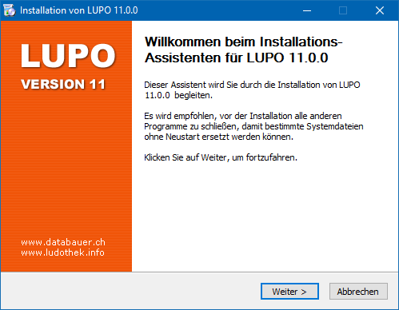
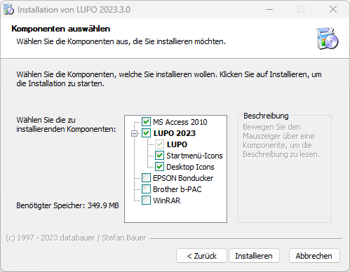

!!! Der Windows-Benutzer, mit welchem LUPO später verwendet wird, muss während der Installation über Administrator-Rechte verfügen.

Starten Sie die Datei **Setup_Lupo2024_de.exe** um mit der Installation zu beginnen. Falls die Windows Benutzerkontensteuerung nachfragt, ob die Software installiert werden soll, beantworten Sie dies mit Ja. Folgen Sie nun den Anweisungen des Setup-Assistenten, welcher sie durch die Installation führen wird.

Klicken Sie auf Weiter > bis folgendes Fenster angezeigt wird:

Ist unter Komponenten LUPO 12 entfernen angewählt, so wird der Programmordner (C:\\Lupo12) und die installierte Access Runtime vor der Installation von LUPO 13 entfernt. Benutzer Dateien (Datenbank und Logos) bleiben dabei erhalten. Dasselbe gilt für eine allfällige ältere LUPO-Installation.

Zusammen mit LUPO kann optional auch die Software für EPSON Bondrucker (detaillierte Informationen dazu sind in der separaten Anleitung zu finden), WinRAR (ein Tool zum Öffnen von LUPO-Datensicherungen) und der Adobe Reader (um pdf-Dateien anzuzeigen) installiert werden. Aktivieren Sie dazu im Dialog Komponenten auswählen die gewünschten Komponenten.

#### Der Installationsassistent erstellt folgende Ordner:

| Ordner | Funktion |
| ------ | ----------- |
|C:\Lupo13 | Das Programmverzeichnis: Hier sind alle von LUPO benötigen Dateien gespeichert. |
|C:\Lupo_Daten | Das Datenverzeichnis mit Ihren persönlichen Daten: Die Datenbank mit den Adressen, Ausleihen, Spielen usw. Lupo13_Daten.accdb und die Logo-Dateien sind hier gespeichert. |
|C:\Lupo_Daten\Spiele-Fotos | Im diesem Unterordner werden die Fotos der Spiele gespeichert |
|C:\Lupo_Daten\Spiele-Fotos-Web | Im diesem Unterordner werden die alternativen Fotos für die Webseite gespeichert |
|C:\Lupo_Daten\Spielanleitungen | Im diesem Unterordner werden die Spielanleitungen (z.B. pdf) gespeichert |

