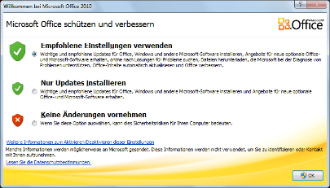
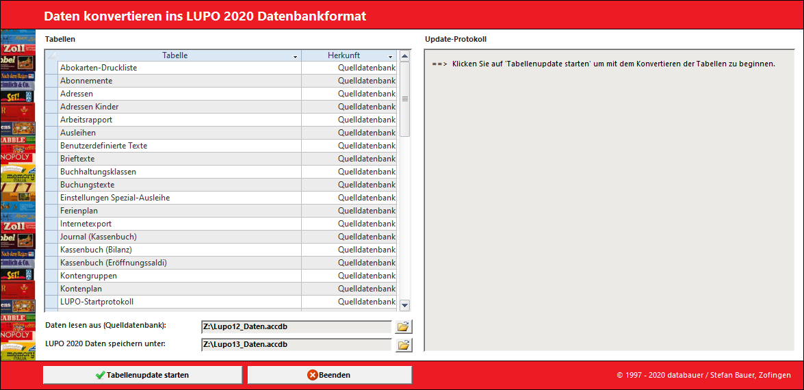
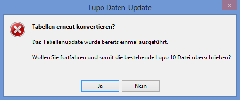

## Office-Updates Dialog beim ersten Start:

Falls Microsoft Office 2010 vor der LUPO-Installation noch nie gestartet wurde erscheint beim ersten Start von LUPO ein Fenster Microsoft Office schützen und verbessern. Wählen Sie Empfohlene Einstellungen verwenden oder Nur Updates installieren.

##Daten einer alten LUPO Installation übernehmen

LUPO 2019 kann nicht mit den Original-Daten einer Vorgängerversion arbeiten. Deshalb muss die Daten-Datei einmalig ins aktuelle Datenbank-Format (accdb-Datei) konvertiert werden.
Starten Sie dazu das LUPO Update Programm ( -Taste drücken, dann nach LUPO Daten-Update suchen):

Normalerweise müssen hier keine Einstellungen angepasst werden. Klicken Sie auf  Tabellenupdate STARTEN um den Vorgang auszuführen.
Erscheint nachstehende Meldung und Sie bestätigen diese mit Ja,dann wird eine bereits vorhandene LUPO 2019 Daten-Datei überschrieben.

!! Beachten Sie das Updateprotokoll. Dort werden allfällige Probleme oder Fehler aufgelistet. Da LUPO 2019 die Daten teilweise ein bisschen anders speichert als bisher, kann es vorkommen, dass einige Datensätze nicht importiert werden können. Dabei handelt es meistens um verwaiste und somit nicht mehr benötigte Daten. (z. B. die Tabelle ‚Adressen Kinder‘ enthält oftmals solche Datensätze)

Nun sollten Sie das LUPO-Programm starten und kontrollieren, ob Ihre Daten übernommen wurden und ob es sich dabei um die aktuelle Datenbank handelt.

!!! Überprüfen Sie ob auch wirklich alle alten LUPO 8/9/10/11 Desktop-Verknüpfungen entfernt wurden. Falls die alte Version beim Start von Windows automatisch gestartet wurde, muss die Verknüpfung in Autostart-Programmordner eventuell angepasst werden.
