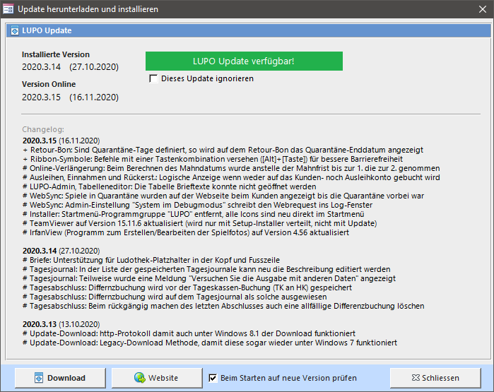

Etwa alle ein bis zwei Monate erscheint ein Update mit Fehlerkorrekturen und neuen Funktionen. Wenn der Computer mit dem Internet verbunden ist, wird im Übersichtsfenster ein Hinweis eingeblendet:

Mit dem ersten Download Button kann die Update-Datei **direkt** aus LUPO heruntergeladen werden. Bevor der Download startet kann festgelegt werden, ob die Datei gespeichert oder ausgeführt werden soll.

Mit dem zweiten Button wird im Browser die Download-Webseite geöffnet, auf welcher die Update-Installationsdatei heruntergeladen werden kann. Zudem kann online die komplette Liste aller Korrekturen und Neuerungen (Release-Notes) gelesen werden.
    
Je nach Browser und Windows-Sicherheitseinstellungen muss noch die eine oder andere Warnung bestätigt werden, bevor die Installationsdatei **Update_Lupo2024_de.exe** ausgeführt werden kann.

**Dieses Update ignorieren**   
Falls sie im Changelog erkennen, dass das Update keine Änderungen bringt, welche Sie aktuell benötigen kann das Update ignoriert werden. Dann wird bis zum nächsten Update der grüne Knopf in der Übersicht nicht mehr angezeigt. 

!! Das Update kann nur installiert werden, wenn LUPO geschlossen ist. Falls LUPO im Netzwerk verwendet wird, dann muss das Update auf jedem PC installiert werden.
