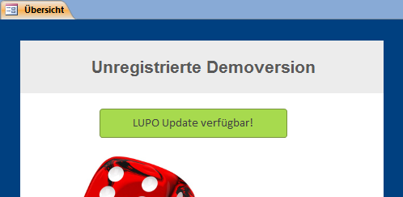

Etwa alle ein bis zwei Monate erscheint ein Update mit Fehlerkorrekturen und neuen Funktionen. Wenn der Computer mit dem Internet verbunden ist, wird im Übersichtsfenster ein Hinweis eingeblendet:

Mit dem ersten Download Button kann die Update-Datei **direkt** aus LUPO heruntergeladen werden. Bevor der Download startet kann festgelegt werden, ob die Datei gespeichert oder ausgeführt werden soll.

Mit dem zweiten Download Button wird die Webseite **www.ludothekprogramm.ch** geöffnet, auf welcher die Update-Installationsdatei heruntergeladen werden kann. Zudem kann online die komplette Liste aller Korrekturen und Neuerungen (Release-Notes) en werden.

Je nach Browser und Windows-Sicherheitseinstellungen muss noch die eine oder andere Warnung bestätigt werden, bevor die Installationsdatei **Update_Lupo11_de.exe** ausgeführt werden kann.

>>>>Das Update kann nur installiert werden, wenn LUPO geschlossen ist. Falls LUPO im Netzwerk verwendet wird muss das Update auf jedem PC installiert werden.