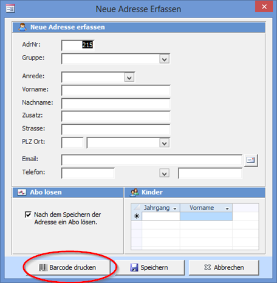

#### Druckertreiber und «P-touch Editor»-Software installieren

!! Installieren Sie als Erstes die Etikettendrucker-Software, welche den Druckertreiber und den P-touch Editor enthält.

Die Setupdatei kann von unserer Webseite heruntergeladen werden:
[Download Brother Druckertreiber und P-touch](https://www.ludothekprogramm.ch/brother)

#### Software b-PAC

Um den Drucker aus LUPO anzusteuern wird neben dem Druckertreiber auch noch die b-PAC Software benötigt.
Diese kann zusammen mit dem LUPO-Setup installiert oder einzeln heruntergeladen und installiert werden:

[Download Brother b-PAC](https://www.ludothekprogramm.ch/download/item/brother-b-pac)

#### Software P-touch Editor

LUPO nutzt zum Drucken Etiketten, welche in der «P-touch Editor»-Software gestaltet wurden. Damit haben Sie maximale Freiheit bei Layout der Barcode-Etikette. Beispielsweise kann eine eigene Schriftart verwendet werden oder Sie können Ihr Logo auf dem Etikett platzieren.

Bei der Installation von LUPO werden folgende Etiketten-Vorlagedateien in den Ordner `C:\Lupo_daten` kopiert:


Dies sind alles Vorlagen der Etikettengrösse 32 mm x 57 mm (Art. N° 11354). Sie können selbstverständlich jedes beliebige andere Etikettenformat verwenden.

!! Die .label-Dateien sind für den DYMO-Drucker und können gelöscht werden.

Öffnen Sie mit der P-touch Editor Software eine Label-Datei:


Unter dem Reiter Einfügen können Sie frei Texte und Bilder dem Etikett hinzufügen oder bestehende Elemente anpassen.

#### Etiketten einrichten

Damit LUPO den Barcode oder Spielnamen mit Inhalt füllen kann müssen die Objekte mit dem korrekten Objektnamen versehen werden. Klicken Sie dazu im **Einfügen-Modus** mit der rechten Maustaste auf ein Objekt, dann wählen Sie **Eigenschaften**.


Gültige Objektnamen, welche von LUPO mit Inhalt gefüllt werden können

**Spiel-Barcode**
```
LUDOTHEK
BARCODE
SPNR
GEBÜHR
SPIELNAME
AUSFÜHRUNG
SPIELNAME-AUSFÜHRUNG
ART
ARTKURZ
ALTER
LAGERORT
INHALT
LIEFERANT
HERSTELLER
AZSPIELER
SPIELDAUER
AUSLEIHTAGE
KAUFPREIS
KATALOGPREIS
BESCHREIBUNG
BESCHREIBUNG_TITEL
BESCHREIBUNG-TITEL
```
**Kunden-Barcode**
```
LUDOTHEK
BARCODE
ADRNR
ANREDE
VORNAME
NACHNAME
VORNAME_NACHNAME
VORNAME-NACHNAME
GRUPPE
STRASSE
PLZ
ORT
PLZ-ORT
ABOENDDAT
```

#### LUPO-Einstellungen

Unter **Übersicht → Einstellungen → Programmeinstellungen** bei Spiel-Barcode den entsprechenden Etikettentyp sowie die Label-Datei wählen:


Und für die Kunden-Barcodes:


#### Einzelne Etikette drucken

Die Etikette eines Spiels kann durch Klicken auf den Barcode-Knopf in **Spiele Erfassen** Fenster gedruckt werden:


Im **Adressfenster** befindet sich hinter der Adressnummer ein Barcode-Knopf zum Drucken des Etiketts.

Ebenfalls kann im Fenster **Neue Adresse** direkt nach dem Eintippen der Adresse ein Etikett gedruckt werden:



!! Der QL-800 Etikettendrucker druckt mit dem Thermodirekt-Verfahren. Ein Nachteil von Thermopapier ist, dass die Etiketten mit der Zeit etwas verblassen. Hitze, direktes Sonnenlicht aber auch die Kunststoffausdunstung von Plastikfolien können diesen Prozess noch beschleunigen. Deshalb sollten die Etiketten nicht mit einer Schutzfolie überklebt werden.
