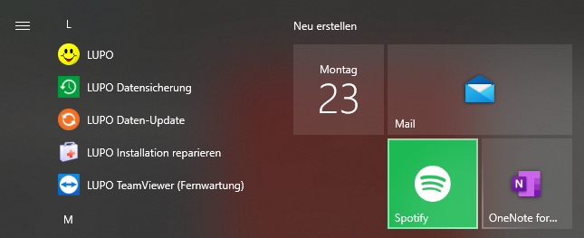
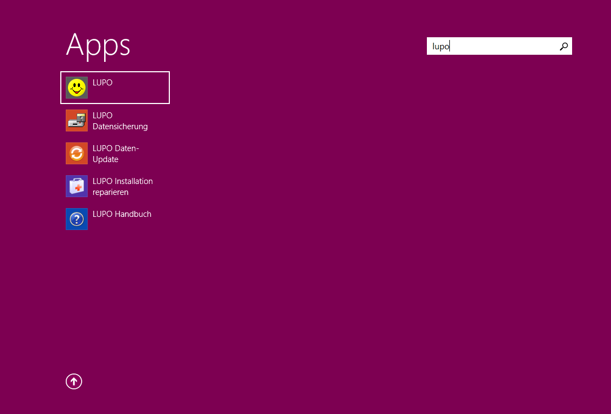

LUPO unter «Alle Apps» im Startmenü von Windows 10

LUPO Apps in Windows 8.1

|				|				|
| ------------- | ------------- |
| LUPO |  LUPO, das Ludothekprogramm. Gleiche Verknüpfung wie auf dem Desktop. |  
| LUPO Datensicherung |  Zurücklesen (Wiederherstellen) von Datensicherungen |  
| LUPO Handbuch |  Zeigt dieses Handbuch im Acrobat-Reader an. |  
| LUPO Installation reparieren |  Falls LUPO nicht mehr gestartet werden kann hilft dies oftmals |  
| LUPO Daten-Update |  Konvertiert die LUPO Datenbank ins aktuelle Format. Nötig beim Update. | 
