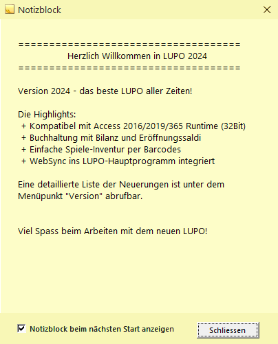

Starten Sie **LUPO** mit dem Desktop-Icon oder über das Startmenü Als erstes Fenster öffnet Sich die **Übersicht**, dann darüber der **Notizblock**.

Im Notizblock können allgemeine Informationen wie z. B. das nächste Sitzungsdatum der Ludothek vermerkt werden. Ist das Kontrollkästchen Notizblock beim Start anzeigen angewählt, wird der Notizblock beim nächsten Start von LUPO automatisch geöffnet. Um den Notizblock erneut zu öffnen, muss der entsprechende Knopf in der Symbolleiste gedrückt werden.