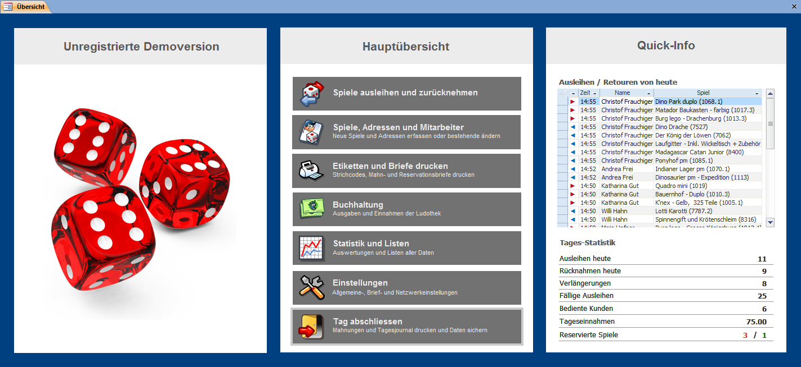

Die **Übersicht** wird automatisch beim Starten von **LUPO** geöffnet. Sie kann auch via [Menüband](/start/menuband-symbolleiste) oder mit der Taste <kbd>F12</kbd> geöffnet werden.

Die Übersicht besteht aus fünf Seiten: Der **Hauptübersicht, Stammdaten, Drucken, Buchhaltung** und der **Einstellungen** Übersicht. Sie können von jeder Unterseite wieder zur Hauptübersicht zurückkehren.
* Spiele Ausleihen/Zurücknehmen
* Spiele, Adressen und Mitarbeiter
    * Spiele erfassen
    * Adressen erfassen
    * Mitarbeiter
    * Arbeitszeiten
* Listen und Etiketten drucken...
    * Spielinhalte drucken
    * Spiel Barcode-Etiketten drucken
    * Kunden Barcode-Etiketten drucken
    * Mahnungen drucken
    * Reservationen drucken
* Buchhaltung
    * Tagesjournal speichern und drucken
    * Buchungen (Kontenblätter anzeigen)
    * Kontobestände
    * Manuell buchen (mit Vorgaben)
    * Manuell buchen (Individuell)
    * Buchungstexte bearbeiten
* Statistik und Listen
* Einstellungen
    * Programmeinstellungen
    * Briefeinstellungen
    * Netzwerkeinstellungen
    * Passwörter
    * LUPO registrieren
    * Übungsversion
