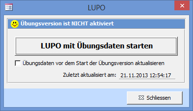
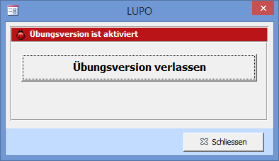
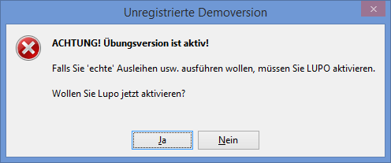

Meistens lernt man ein Computerprogramm am einfachsten kennen, indem man die verschiedenen Funktionen ausprobiert und mit dem Programm spielt. Deshalb besteht in LUPO die Möglichkeit mit Übungsdaten zu arbeiten. Damit Sie auf keinen Fall versehentlich in der Übungsversion arbeiten oder umgekehrt, unterscheiden sich die beiden Versionen durch das Übersichtsbild Übungsversion anstelle dem Logo ihrer Ludothek und die Fenster-Titelbalken werden **rot anstatt blau oder grau** dargestellt.

## Mit Übungsdaten starten / verlassen

Die Übungsversion kann über den Menübefehl **Übungsdaten** aktiviert bzw. desaktiviert werden.

Ist das Häkchen gesetzt, dann wird die aktuelle Daten-Datenbank in die Übungsversion kopiert.

Die Übungsversion verlassen um wieder mit den „echten" Daten zu arbeiten.

#### Übungsdaten beim Starten von LUPO

Bevor beim Start von LUPO die Übungsdaten geladen werden erscheint folgende Warnung:

Klicken Sie auf Ja um mit den 'richtigen' Daten zu arbeiten oder wählen Sie Nein um weiterhin mit den Übungsdaten zu spielen.
