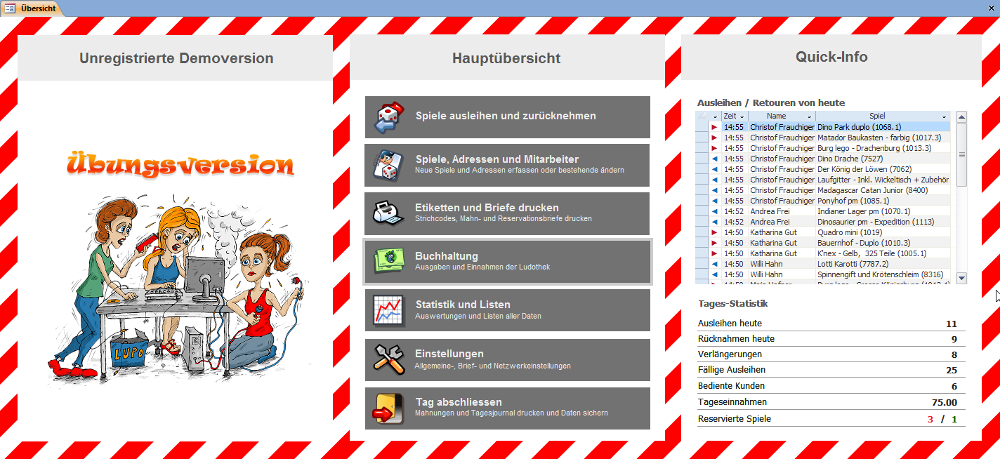

Meistens lernt man ein Computerprogramm am einfachsten kennen, indem man die verschiedenen Funktionen ausprobiert und mit dem Programm spielt. Deshalb besteht in LUPO die Möglichkeit mit Übungsdaten zu arbeiten. Damit Sie auf keinen Fall versehentlich in der Übungsversion arbeiten oder umgekehrt, unterscheiden sich die beiden Versionen durch das Übersichtsbild Übungsversion anstelle dem Logo ihrer Ludothek und die Fenster-Titelbalken werden **rot anstatt blau oder grau** dargestellt.

Das Übersichtsfenster mit aktivierten Übungsdaten