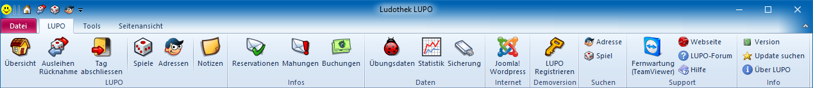
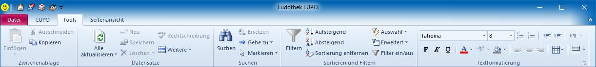
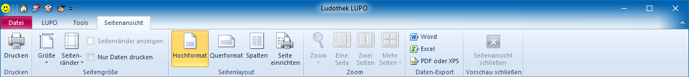
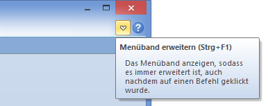

Das LUPO-Menüband (Ribbon) bietet direkten Zugriff auf die wichtigsten Fenster und Funktionen.

Im Tools-Tab liegen Funktionen zur Sortierung von Datenblättern und zur Formatierung von Rich-Text Feldern.

Wenn ein Bericht geöffnet ist wird das Menüband Seitenansicht angezeigt. Hier finden Sie Funktionen um die Seite und Druckausgabe anzupassen. Mit den Befehlen der Gruppe Daten-Export kann der Seiteninhalt als pdf-, Word- oder Excel-Datei gespeichert werden.

Das Menüband kann eingeklappt werden. Um die Anzeige wiederherzustellen muss auf den Pfeil links im Fenster geklickt werden:

