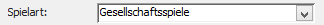

#### Fenster schliessen (Registerkarte)

Das X rechts auf Höhe der Registerkarten schliesst das Fenster.

#### Statusleiste

Die Statusleiste befindet sich am unteren Bildschirmrand. Dort wird für die meisten Steuerelemente eine kurze Beschreibung angezeigt.

#### Datensatz-Navigator

Mit diesen Steuerelementen kann zwischen dem ersten, vorherigen, nächsten und letzten Datensatz im aktuellen Datenblatt geblättert werden. Die Schaltfläche  erstellt einen neuen Datensatz.

#### Rich-Text Felder

Einige Textfelder – z.B. das Spielmemo oder der Spielinhalt – können formatierten Text enthalten. Sobald Text markiert wird, wird eine Symbolleiste zum Formatieren eingeblendet:

#### Kalender

Immer wenn hinter einem Datum das Kalendersymbol angezeigt wird können Sie durch Klicken den Kalender öffnen. Mit Heute wechseln Sie im Kalender zum aktuellen Datum, mit Übernehmen wählen Sie das angwählte Datum aus.

Ferientage werden im Kalender rot dargestellt

#### Barcodes

Strichcodes können in folgenden Fenstern eingelesen werden:

Adress-Strichcodes: **Ausleihfenster, Adressen, Adressen Suchen**

Spiel-Strichcodes: **Ausleihfenster, Spiele, Spiele Suchen**

#### Auswahlfeld / Kombinationsfeld

Das Feld kann mit der Maus oder durch Drücken der **[F4]**-Taste aufgeklappt werden. Wenn Sie in ein leeres Auswahlfeld schreiben, wird der angezeigte Eintrag durch drücken von **[Enter]** ausgewählt. Es gibt zwei Arten von Auswahlfeldern: Die einen lassen jede Texteingabe zu, die andern erlauben nur Eingaben aus der vorhandenen Auswahl.

#### Bedienung mit der Tastatur

In Windows gibt es wichtige Tastaturbefehle, welche in fast jedem anderen Programm verwendet werden können und die Bedienung erleichtern. Darunter zählen unter andern:

**[Ctrl]+[c]** um die Markierung in die Zwischenablage zu kopieren.

**[Ctrl]+[x]** um die Markierung auszuschneiden und in die Zwischenablage zu kopieren.

**[Ctrl]+[v]**um den Inhalt der Zwischenablage einzufügen.

**[Ctrl]+[f]** öffnet das Suchfenster, nützlich in einem Datenblatt.

**[Ctrl]+[h]** öffnet das Suchen und Ersetzen Fenster, nützlich in einem Datenblatt.

**[Ctrl]+[z]** um die letzte Aktion rückgängig zu machen

**[Ctrl]+[a]** um alles auszuwählen.

**[ESC]** um die letzte Eingabe rückgängig zu machen und teilweise um ein Fenster zu schliessen.