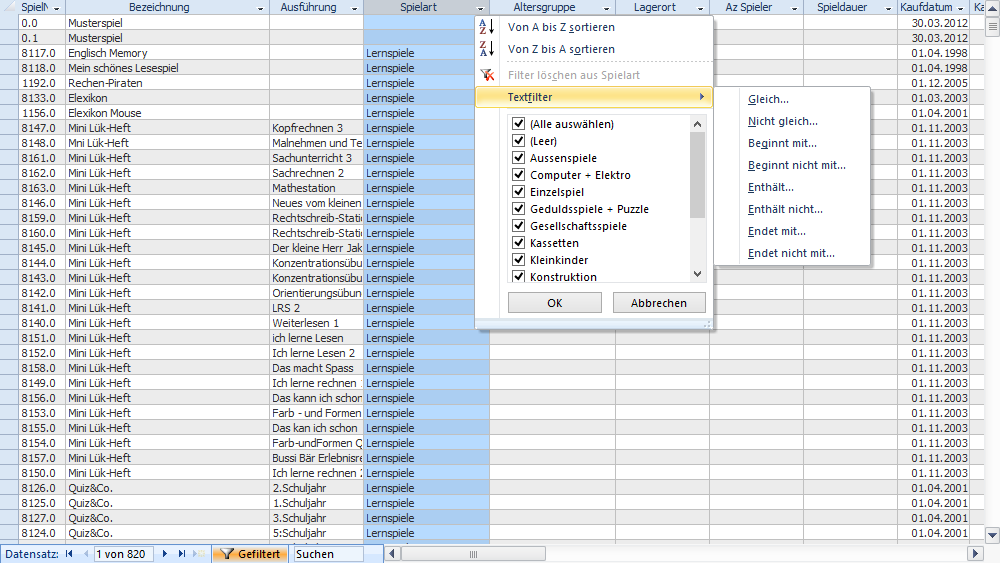
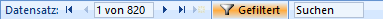
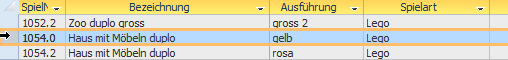

Datenblätter enthalten eine tabellarische Darstellung von Daten. Der angezeigte Inhalt kann sortiert und/oder mit einem Filter eingeschränkt werden.

Um eine Spalte zu Filtern oder um die Datensätze zu sortieren, kann auf den kleinen Pfeil im Spaltentitel geklickt werden.

Um den Filter zu entfernen klicken Sie auf den Knopf **Gefiltert** im Datensatznavigator:

Mit dem Feld Suchen kann nach Text im Datenblatt gesucht werden. Schreiben Sie dazu ihr Suchbegriff in das Textfeld und navigieren dann durch mehrfaches drücken von <kbd>Enter</kbd> zu den einzelnen Datensätzen welche den Suchbegriff enthalten.

!!! Nutzen Sie diese Filter- und Sortierfunktionen!** Es sind vielseitig einsetzbare und einfach zu handhabende Funktionen. Sie können so zum Beispiel in den Listen des **Statistikfensters** die Daten sortieren und filtern, um sie nachher via Zwischenablage in Excel zu kopieren, um dort Summen zu berechnen, Diagramme zu erstellen usw.

!! **Achtung**: Die Filter- und Sortiereinstellungen gehen nach dem **Schliessen** des Formulars **verloren!**

#### Datensätze markieren

Datensätze können durch Klicken auf den Datensatzmarkierer links im Datenblatt ausgewählt werden, um diese anschliessend zu kopieren oder löschen.
