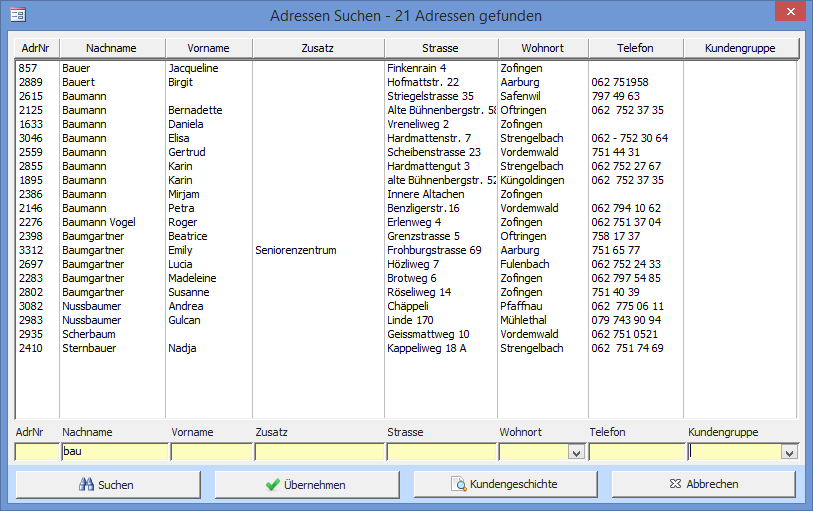

Das **Adresse suchen** Fenster kann via dem **Menüband** oder dem Feldstecher-Button geöffnet werden.

Schreiben Sie in die gelben Felder das Suchkriterium für die entsprechende Spalte. Starten Sie die Suche indem Sie auf Suchen klicken. Die Liste kann durch einen Klick auf den Knopf im Spaltentitel entsprechend sortiert werden.

**Beispiel:** Wird im 'Ort' Suchfeld **z**, und im 'Name' Suchfeld **bau** eingegeben, werden alle Adressen, die mit **z** und **bau** beginnen angezeigt.

Übernehmen schliesst das Such-Fenster und öffnet die Adresse im **Adressen**\- oder **Ausleihen und Zurücknehmen**-Fenster mit der in der Suchliste markierten Adressen. Einen Doppelklick auf eine Adresse in der Suchliste hat die gleiche Wirkung.

Kundengeschichte öffnet den Bericht mit der Kundengeschichte der markierten Adresse in Seitenansicht.
