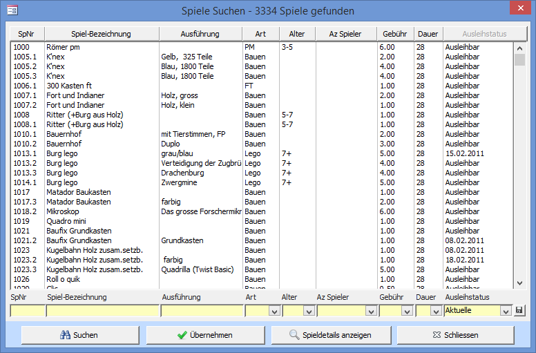

Das **Spiel suchen** Fenster kann via dem **Menüband** oder dem Feldstecher-Button geöffnet werden.

Schreiben Sie in die gelben Felder das Suchkriterium für die entsprechende Spalte. Starten Sie die Suche indem Sie auf Suchen klicken. Die Liste kann durch einen Klick auf den Knopf im Spaltentitel entsprechend sortiert werden.

**Beispiel:**Wird im Bezeichnung Suchfeld **game** eingegeben, werden alle Spiele, die mit dieser Bezeichnung beginnen (wie Game Boy, ...) angezeigt.

#### Spielnummer mit *

Bei Spielnummern mit einem * (z.B. 3012*) am Schluss der Nummer handelt es sich um eSpiele.

#### Ausleihstatus (Rückgabedatum)

Wählen Sie aus, welche Spiele in der Liste angezeigt werden sollen. Ist Aktuelle ausgewählt werden alle Spiele, welche nicht liquidiert sind, angezeigt. Durch Drücken des Diskettensymbols wird die Auswahl als Vorgabe für das nächste Öffnen des Fensters gespeichert.

Übernehmen: schliesst das Fenster und aktualisiert das Spiel im **Spiele**\- oder **Spiele Ausleihen und Zurücknehmen** Fenster mit dem in der Suchliste markierten Spiel. Einen Doppelklick auf ein Spiel in der Suchliste hat die gleiche Wirkung.

Spieldetails anzeigen öffnet ein Fenster mit detaillierten Informationen zum Spiel.
