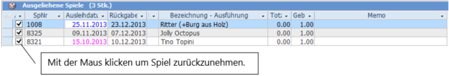
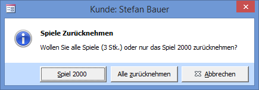
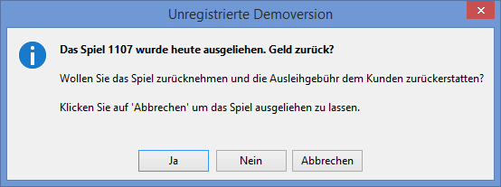

Tragen die Spielnummer in das Spielnummernfeld ein und drücken dann den Button  Rücknahme oder **[Enter]**. Es wird automatisch zum Kunden, welcher das Spiel ausgeliehen hat, gewechselt.

#### Zurücknehmen

Die Spiele können auch durch „abhaken" in der **Kundenspielliste** einzeln zurückgenommen werden oder indem Sie die Spielnummer ins Spielnummernfeld schreiben und auf den Knopf Rücknahme drücken.

Ist das Spiel an einen anderen Kunden als dem aktuell angezeigten ausgeliehen so wechselt LUPO automatisch zum Kunden welcher das Spiel ausgeliehen hat

  
>>> Wenn Sie die Spielnummer in das Spielnummernfeld eingetragen haben drücken Sie **[Enter]**. Je nachdem ob das Spiel ausgeliehen oder in der Ludo liegt wird durch **[Enter]** der Ausleihen oder der Zurücknehmen Button betätigt. (Gilt nur, wenn in den Einstellungen unter **Einstellungen => Ausleihen => Erweitere Ausleiheinstellungen** die **[Enter]**-Taste zum Zurücknehmen von Spielen erlaubt ist.)

#### Häkchen „Gebühr zurückerstatten"

Setzen Sie dieses Häkchen, wenn die Ausleihgebühr beim Zurücknehmen dem Kunden zurückerstattet werden soll.

#### Alle zurück

Es werden alle Spiele des aktuellen Kunden zurückgenommen (Es gibt eine Einstellung um diesen Knopf auszublenden).

#### Rückgabedatum entspricht dem Ausleihdatum

Wenn Sie ein Spiel am gleichen Tag zurücknehmen, an welchem Sie dieses ausgeliehen haben, dann erscheint folgende Meldung:

Wenn Sie auf Ja klicken wird das Spiel zurückgenommen und die Ausleihgebühr dem Kunden zurückerstattet. Klicken Sie auf Nein, wird das Spiel ebenfalls zurückgenommen, jedoch bleibt die verrechnete Ausleihgebühr dem Kundenkonto belastet. Mit Abbrechen bleibt das Spiel ausgeliehen.