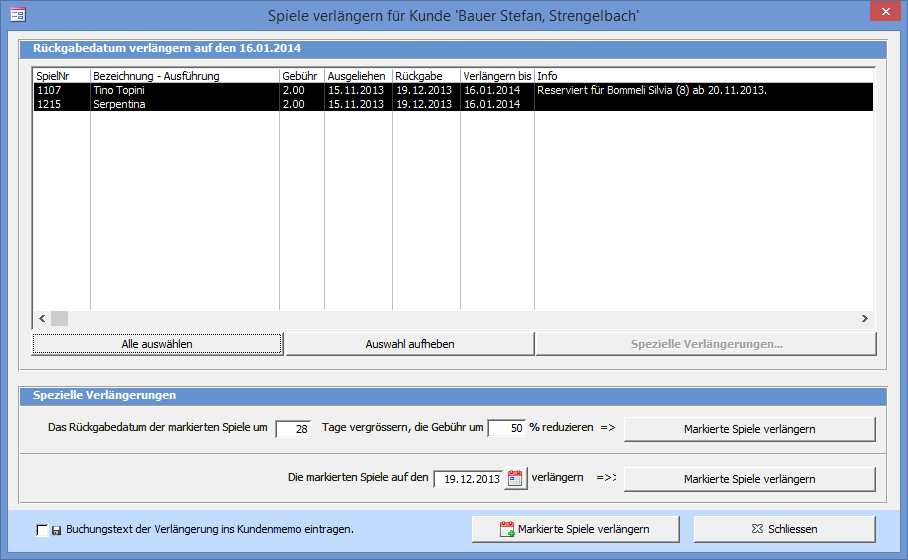
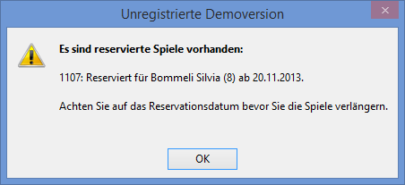

Klicken Sie auf Verlängern im Spiele Ausleihen und Zurücknehmen Fenster um den folgenden Dialog angezeigt zu bekommen:

Falls reservierte Spiele vorhanden sind erscheint zuerst folgende Meldung:

Danach sind in der Spalte Info die Besonderheiten wie Ferien oder Reservationen des Spieles ersichtlich.

Der Knopf Markierte Spiele verlängern am unteren Fensterrand ändert das Rückgabedatum der markierten Spiele auf das beim Spiel in der Spalte Verlängern bis aufgelistete Datum.

Die Spielgebühr wird dem Ausleihkonto verrechnet, ist dieses leer **(Null)**, dem Kundenkonto.

#### Spezielle Verlängerungen

Klicken Sie auf Spezielle Verlängerungen um weitere Optionen zur Verlängerung anzuzeigen. Um eine spezielle Verlängerung anzuwenden, verwenden Sie den entsprechenden Knopf.

>>>>> Beachten Sie auch Möglichkeiten in den **Einstellungen => Ausleihen**. Je nach Konfiguration wird das neue Rückgabedatum aus dem alten + 28 Tage berechnet oder es wird das aktuell eingestellte Stempeldatum verwendet.

Wenn Sie ein Spiel nur für wenige Tage verlängern wollen, können Sie dies auch über die Funktion **Rückgabedatum manuell ändern** tun. Dabei wird dem Kunden keine Gebühr verrechnet.