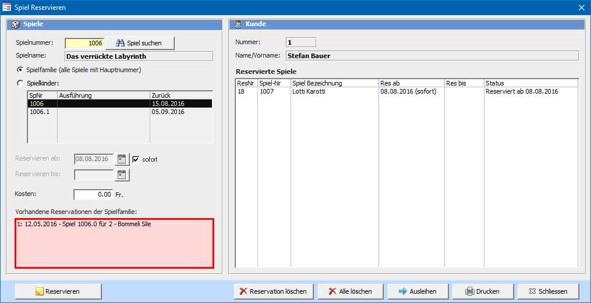
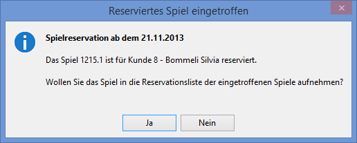
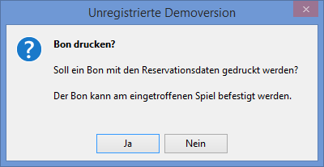

Sie können Spiele auf den im Fenster **Spiele ausleihen und zurücknehmen** angezeigten Kunden reservieren. Geben Sie die Spielnummer in das Feld ein, und drücken Sie den Reservieren Button.

Eine Reservation kann sich auf mehrere Spiele beziehen. Es kann nicht nur ein einzelnes Spiel, sondern die ganze Spielfamilie (3371.X), oder nur bestimmte davon auf eine Reservation genommen werden.

Sobald das erste aller reservierten Spiele (einer Reservation) eintrifft, gelten die andern als nicht mehr reserviert.

#### Spielnummer

Nummer der Spielfamilie. Verwenden Sie das Spielsuchfenster um eine Spielnummer aus der Liste auszuwählen.

#### Reservieren ab

Aktuelles Datum (voreingestellt = heute) Ab diesem Datum beginnt die Reservation. Wird das reservierte Spiel vor diesem Datum ausgeliehen, gilt es als nicht reserviert und es erscheint auch keine Meldung beim Ausleihen. Ist ein Spiel mehrmals reserviert, wird die Reservation mit dem ältesten Reservationsdatum zuerst berücksichtigt.

#### Spielfamilie / Spielkinder

Es kann die gesamte Spielfamilie oder ein Spielkind aus der Liste reserviert werden. In der Liste werden alle Spiele der Spielfamilie angezeigt. Die Liste enthält die Spielkinder mit Nummer, Ausführung und dem **(soll)** Rückgabedatum. Ist das Spiel nicht ausgeliehen, wird in Ludothek! angezeigt.

Um ein einzelnes, oder mehrere einzelne Spiele zu reservieren, müssen die entsprechenden Spielkinder in der Liste markiert werden.

#### Kosten

Die Kosten für die Reservation beim Erstellen der Reservation. Neben diesem kann auch ein Betrag beim Ausleihen des reservierten Spiels verrechnet werden.

#### Reservation löschen

Löscht die in der Liste markierte Reservation. Bei einer Spielfamilienreservation wird die ganze reservierte Familie gelöscht.

#### Reserviertes Spiel trifft ein

Sobald ein reserviertes Spiel eintrifft, erscheint eine Meldung auf dem Bildschirm:

Wenn Sie diese Meldung mit Ja bestätigen kann ab jetzt der Mitteilungsbrief (Spiel ist eingetroffen) an den Kunden gedruckt werden. Das Spiel gilt als so lange reserviert, wie in den **Einstellungen => Ausleihen** eingetragen ist.

Falls ein Bondrucker angeschlossen ist, kann ein jetzt ein Bon mit Informationen zur Spielreservation ausgedruckt und am Spiel befestigt werden.

