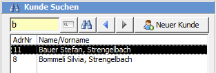
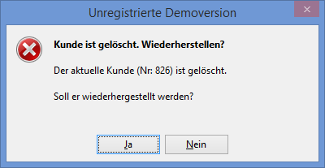
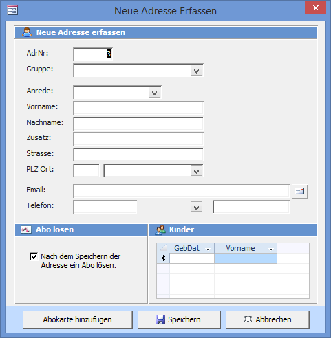

Alle Aktionen (wie Abo lösen, Spiel ausleihen, reservieren, ...) die Sie im Fenster Spiele ausleihen und zurücknehmen ausführen, beziehen sich auf den rechts im Fenster angezeigten Kunden. Die linke Seite mit der Adressliste dient zum Suchen bestehender und Erfassen neuer Adressen.

Sie können den Nachnamen, Vornamen, Ort oder einen Teil davon oder die Adressnummer in das Suchfeld eingeben. Durch Drücken von <kbd>Enter</kbd> oder des Such-Buttons rechts vom Suchfeld wird die Suche gestartet. Wählen Sie den gewünschten Name durch klicken in die Suchergebnisliste aus.

**Phonetische Suche:**  
Wenn Sie einen Namen falsch eintippen und die Suche nichts findet wird automatisch ein zweite phonetische Suche gestartet. So wird bei einer Suche nach Abüehl trotz falscher Schreibweise der Name Abbühl gefunden.

Wenn Sie Kundenkarten mit Barcodes verwenden kann irgendein Feld im Ausleihfenster aktiv sein wenn Sie den Strichcode einscannen. Der Cursor muss dazu nicht vorher in das Kunden-Suchfeld gesetzt werden.

Die Feldstecher-Taste öffnet das Suchfenster, mit den Pfeiltasten können Sie in den bereits angezeigten Kunden vor und zurückblättern.

Wenn Sie ein **Spiel zurücknehmen**, wechselt das Programm automatisch zum Kunden, welcher das Spiel zurückbringen will. Es ist nicht notwendig, die Adresse vor der Rücknahme durch Suchen anzuzeigen.

Wird die Adressnummer eines gelöschten Kunden eingeben, erscheint folgende Meldung:

#### Neuer Kunde erfassen

Der Knopf Neuer Kunde öffnet das Fenster um eine Adresse zu erfassen. Die Adressnummer wird automatisch vorgeschlagen, kann aber verändert werden.

Ist das Kontrollkästchen **Nach dem Speichern der Adresse ein Abo lösen** aktiviert, so öffnet sich automatisch das **Abo lösen** Fenster.

Barcode drucken wird angezeigt, wenn Sie die Barcodes mit dem Etiketten-Drucker ausdrucken.

Das LUPO-Programm prüft während der Eingabe der Adresse ob ein Duplikat vorhanden ist. Stimmen Name, Vorname und Strasse mit einer bereits gespeicherten Adresse überein, so erscheint folgende Meldung:

Merken Sie sich die Adressnummer und brechen die Erfassung des Kunden ab.
