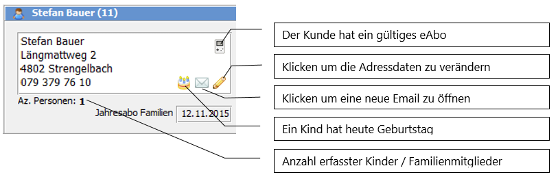
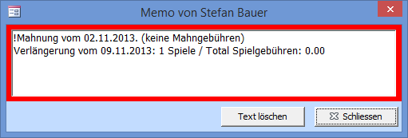
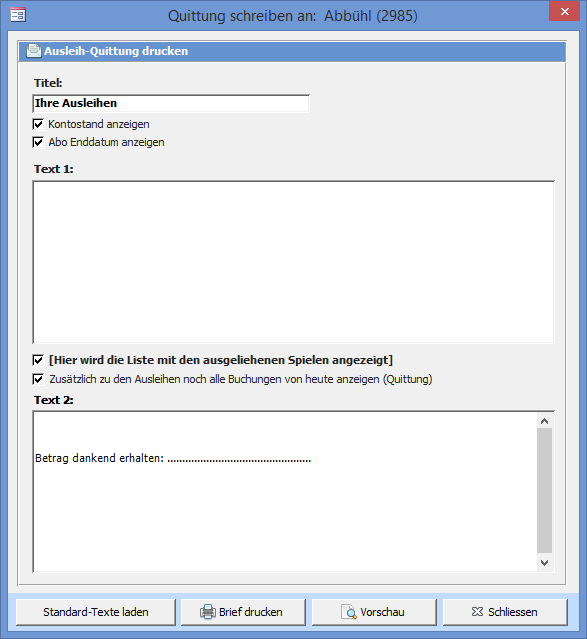
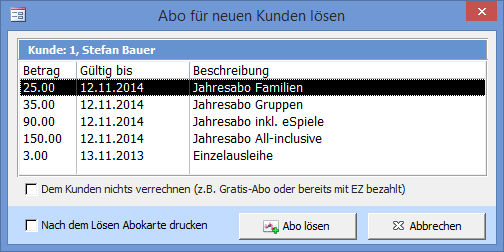

Bei der im weissen Adress-Feld angezeigten Adresse handelt es sich jeweils um den aktiven Kunden.

#### Kundenmemo

Bei Kunden mit Text im Memofeld wird dieses rot dargestellt. Um ein neues Memo zu schreiben oder ein bestehendes zu bearbeiten einfach in das Feld klicken.

Schreiben Sie am Anfang des Memos ein ! (Ausrufezeichen), um das Memo beim Aufruf des Kunden in einem separaten Fenster angezeigt zu bekommen:

! **Automatische Kundenmemos**  
! Beim Mahnen wird automatisch ein Memo geschrieben. Die kann in den Einstellungen deaktiviert werden.

Der Knopf  Kundengeschichte zeigt alle Adressdetails und alle jemals vom Kunden ausgeliehenen Spiele an.

Mit  Bon Drucken  wird ein Bon auf den Kassendrucker ausgegeben. Normalerweise muss dieser Knopf nicht gedrückt werden da der Bon automatisch beim Bezahlen ausgedruckt wird.

#### Brief drucken

Sie haben die Möglichkeit einen Brief mit den Ausleihen und optional den dazu angefallenen Kosten (Abonnement, Reservation, ...) auszudrucken.

Um den Brieftext zu ändern muss in den **Briefeinstellungen** der Textkörper Quittung angepasst werden.

Wird der Brieftext abgeändert speichert LUPO diesen und er wird beim nächsten Öffnen des Fensters wieder angezeigt. Mit Standard-Texte laden werden die in den Brief-Einstellungen definierten Texte geladen.

#### Abonnement lösen

Damit der Kunde Spiele ausleihen kann, muss er ein gültiges Abo besitzen (Falls ein gültiges Abo zur Ausleihe nicht zwingend ist, muss dies in den Einstellungen, Registerkarte Beiträge definiert werden).

Sie müssen sich keine Gedanken darüber machen, ob der Kunde ein gültiges Abo hat oder nicht. Sobald Sie ein Spiel an jemanden ausleihen möchten, dessen Abo abgelaufen ist, öffnet sich automatisch das Fenster zu erneuern des Abos:

Die Gültigkeitsdauer und Preise können in den **Einstellungen** definiert werden.

Hat der Kunde den Jahresbeitrag bereits per Einzahlungsschein bezahlt, so kann das Häkchen Dem Kunden nichts verrechnen aktiviert werden. Soll diese Funktion nicht zur Verfügung stehen, so kann diese in den Einstellungen deaktiviert werden.

Der Verkauf eines Abos kann durch Drücken der Zurücktaste rückgängig gemacht werden. Diese Funktion steht nur einmal für das zuletzt verkaufte Abo zur Verfügung.
