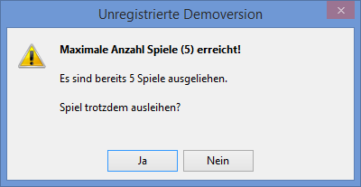
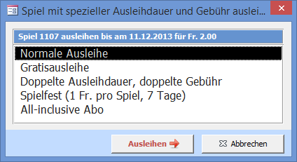
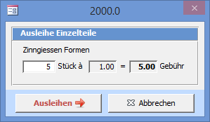
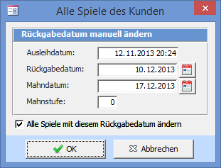

Die Spiele, welche Sie ausleihen, werden der Spielliste des aktuellen Kunden hinzugefügt.

#### Ausleihen Button

Leiht das in das Spielnummerfeld eingetragene Spiel aus. Klicken Sie dazu auf den Ausleihen Button oder drücken Sie die <kbd>Enter</kbd>-Taste.

Falls Sie mit Barcodes arbeiten kann beim Einscannen irgendein Feld im Ausleihfenster aktiv sein. Der Cursor muss vor dem Scannen nicht in das Spiel-Suchfeld gesetzt werden.

! **Verhalten der Enter-Taste**  
! Ob Spiele mit <kbd>Enter</kbd> ausgeliehen oder zurückgenommen oder immer ausgeliehen werden kann unter **Einstellungen => Ausleihen => Spiele Ausleihen / Zurücknehmen** definiert werden.

#### Einschränkung Anzahl Spiele

Die maximale Anzahl Spiele und / oder eSpiele pro Kunde kann eingeschränkt werden. Die Anzahl ist beim Abo vorgegeben und wird beim Verkauf eines solchen beim Kunden gespeichert. Beim Überschreiten der definierten Anzahl erscheint folgende Meldung:

#### Spezial-Ausleihe

Mit Hilfe einer Spezial-Ausleihe kann ein Spiel mit einer **veränderten Ausleihdauer und einer veränderten Gebühr** in einem Schritt ausgeliehen werden.

Durch Drücken auf den Knopf  Spezial Ausleihe  oder wenn das Häkchen Spezial-Ausleihe aktiviert ist, wird vor der Spielausleihe folgendes Fenster angezeigt:

Die zur Auswahl stehenden Spezial-Ausleihen können in den Einstellungen definiert werden. Ist nur eine aktive Spezial-Ausleihe definiert, so wird diese beim Ausleihen automatisch angewandt und das Fenster nicht angezeigt.

#### Einzelteil Ausleihe

Wenn beim Spiel die Eigenschaft Einzelteil gesetzt ist, erscheint beim Ausleihen folgender Dialog:

Geben Sie die Anzahl Stück ein und drücken Sie  Ausleihen . Die Spielgebühr wird mit der Stückzahl multipliziert und dem Kunden verrechnet. Die Anzahl wird ins Spielkind-Memo geschrieben.

#### Stempeldatum manuell ändern

Manchmal ist es notwendig, das Rückgabedatum zu verändern, ohne das Spiel zu verlängern (eine Verlängerung ist normalerweise kostenpflichtig). Doppelklicken Sie auf das Ausleih- oder Rückgabedatum in der Spielliste um folgendes Fenster angezeigt zu bekommen:

Nachdem Sie das Rückgabedatum verändert haben, wird das Mahndatum automatisch neu berechnet.

Aktivieren Sie Alle Spiele mit diesem Rückgabedatum ändern um die restlichen Ausleihdaten des aktuellen Kunden auch anzupassen. Hat ein Spiel eine spezielle Mahnfrist, so wird dies berücksichtigt.
