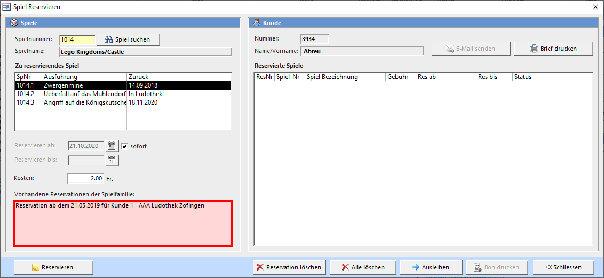

Sie können Spiele auf den im Fenster **Spiele ausleihen und zurücknehmen** angezeigten Kunden reservieren. Geben Sie die Spielnummer in das Feld ein um dann mit dem Reservieren Button die Reservation mit den unthalb definierten Daten zu speichern.

**Spielnummer**  
Die Nummer der Spielfamilie. Verwenden Sie das Spielsuchfenster um eine Spielnummer aus der Liste auszuwählen.

**Reservieren ab**  
Aktuelles Datum (voreingestellt = heute). Ab diesem Datum beginnt die Reservation. Wird ein reserviertes Spiel ausgeliehen und das Rückgabedatum liegt zwei Wochen vor diesem Datum, gilt es als nicht reserviert und es erscheint auch keine Meldung beim Ausleihen. Ist ein Spiel mehrmals reserviert, wird die Reservation mit dem ältesten Reservationsdatum zuerst berücksichtigt.

**Kosten**
Die Kosten für die Reservation beim Erstellen der Reservation. Neben diesem kann auch ein Betrag beim Ausleihen des reservierten Spiels verrechnet werden.

**Reservation löschen**  
Löscht die in der Liste markierte Reservation.

**Alle löschen**
Löscht alle reservationen des Kunden.

**Ausleihen**
Leiht das in der Liste der reservierten Spiele dem aktiven Kunden aus.

**Bon drucken**  
Druckt den Bon mit den Reservationsdaten, welcher am Spiel befestigt werden kann.

#### Reserviertes Spiel trifft ein

Sobald ein reserviertes Spiel eintrifft, erscheint eine Meldung auf dem Bildschirm:

Wenn Sie diese Meldung mit Ja bestätigen kann ab jetzt der Mitteilungsbrief (Spiel ist eingetroffen) an den Kunden gedruckt werden. Das Spiel gilt als so lange reserviert, wie in den **Einstellungen → [Ausleihen](/einstellungen/allgemeine-einstellungen/ausleihen)** eingetragen ist.

Falls ein Bondrucker angeschlossen ist, kann jetzt ein Bon mit Informationen zur Spielreservation ausgedruckt und am Spiel befestigt werden.

