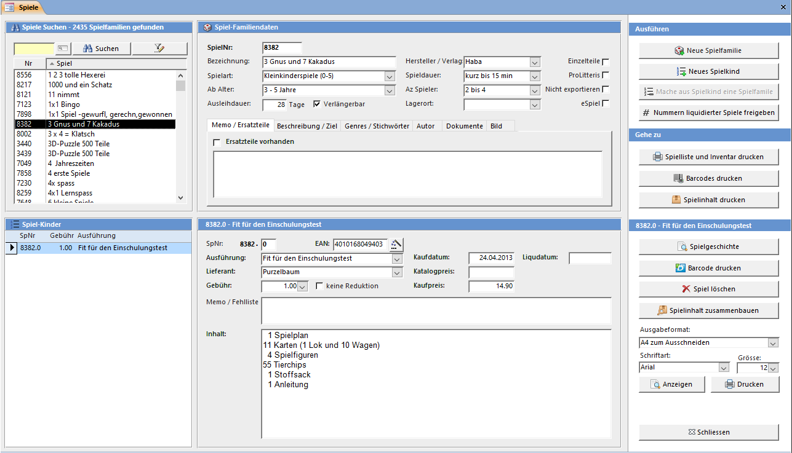

In LUPO werden die Spiele als Spielfamilien mit Kindern verwaltet. Eine Spielfamilie hat eine Spielnummer, meistens 4- oder 5-stellig. Die Kinder erben diese Familiennummer und kennzeichnen sich durch Ihren Index. Das erste Kind bekommt den Index 0 (Null). Bei Spielnummern mit .0 wird nur die Hauptnummer angezeigt.

Fügen Sie einer Familie alle gleichen oder stark ähnlichen Spiele (andere Ausführung, alt und neu, ...) als Kinder hinzu. Wird ein Spiel ersetzt, dann sollte das neue Spiel als weiteres Spielkind erfasst werden.

Beim Reservieren eines Spiels kann so die ganze Familie reserviert werden. Sobald ein Exemplar der Spielfamilie zurückgebracht wird löst die Reservation aus und die anderen reservierten Spielkinder werden freigegeben.

Das **Spiele erfassen und bearbeiten** Fenster können Sie mit der **Übersicht** oder der **Symbolleiste** öffnen.

#### Spiel suchen

Geben Sie den Spielnamen oder die Spielnummer in das Suchfeld ein. In der Liste unter dem Suchfeld werden alle gefundenen Spiele angezeigt. Wählen Sie das gewünschte aus. Sie können auch Spiele über das Spiele Suchen Fenster suchen.

Unterhalb links werden alle Spielkinder der oben ausgewählten Spielfamilie angezeigt.

#### Der Familiennummer zugeordnet sind:

Diese Felder enthalten Informationen die für alle Spielkinder gelten.

#### Spielfamiliennummer

Spielnummer (Nummer ohne Index). Normalerweise vier- oder fünfstellig.

#### Bezeichnung

Spielname für die ganze Spielfamilie.

#### Spielart

Es können die in den Einstellungen eingetragenen Spielarten ausgewählt werden.

#### Ab Alter

Altersgruppe. Es können die in den Einstellungen eingetragenen Altersgruppen ausgewählt werden.

#### Ausleihdauer (in Tagen)

So viele Tage beträgt die Ausleihdauer eines Spiels. Die Normalausleihdauer welche vorgeschlagen wird, kann in den Einstellungen bestimmt werden.

#### Verlängerbar

Spiele ohne dieses Häkchen können nicht verlängert werden.

#### Hersteller / Verlag

Der Verlag oder Hersteller des Spiels. Alle bereits vorhandenen Einträge stehen zu Auswahl.

#### Spieldauer

Spieldauer in Minuten. Versuchen Sie verschiedene Werte möglichst einheitliche einzutragen.

#### Anzahl Spieler

Anzahl Personen, welche mitspielen können. Erfassen Sie die Anzahl Spieler vor allem bei Spielen, die alleine oder in grossen Gruppen gespielt werden können.

#### Lagerort

Kann das Gestell oder eine andere Angabe zum Aufbewahrungsort des Spiels enthalten.

#### Einzelteile

Wenn Sie Spiele wie Backförmli, Zinngiessfiguren oder ähnliches haben, muss nicht für jedes Stück eine einzelne Nummer gelöst werden. Wenn Sie 50 Stück haben und damit rechnen dass, wenn alle ausgeliehen sind, jeder Kunde im Durchschnitt 5 Stück hat, sollten Sie etwa 10 Spielkinder erstellen. Beim Ausleihen eines Einzelteils erscheint ein Dialog welcher Sie zum Eingeben der Anzahl auffordert. Für jedes Stück wird die Gebühr verrechnet.

#### ProLitteris

Das schweizerische Urheberrechts-gesetz (URG) verlangt die Abgabe eines Teils der von den Benützern bezahlten Entgelte. Davon betroffen sind die Einnahmen aus Ausleihen von Ton- und Tonbildträger sowie Büchern. Bei ProLitteris pflichtigen Spielen wir bei jeder Ausleihe der abgabepflichtige Teil (12%) der Spielgebühr berechnet. (Nachträgliches Berechnen unter **Einstellungen => ProLitteris** möglich)

#### Nicht exportieren

Spiele mit diesem Attribut werden beim Internetexport (XML und HTML) ausgeschlossen.

#### eSpiel

Als eSpiel werden elektronische Spiele, z.B. GameBoy Kassetten oder PS3 CDs verstanden. eSpiele haben keine Ausleihgebühr dafür muss der Kunden zum Ausleihen ein spezielle eAbo besitzen.

#### Memo / Ersatzteile

Ein Feld für Bemerkungen, welche hauptsächlich zur Spieladministration interessant sind. Der hier eingetragene Text ist in der Liste der Spiele im Ausleihfenster nicht direkt sichtbar. Ist das Häkchen Ersatzteile vorhanden gesetzt so ist dies im Ausleihfenster durch einen gelben Hintergrund des Spielkind-Memo ersichtlich.

#### Beschreibung / Ziel

Eine Kurzbeschreibung zum Spiel. Wird im Internetexport eingeschlossen und beim Spiel auf der Website angezeigt. Im Feld Titel kann ein kurzer Text definiert werden der auf der Webseite fett oberhalb der Beschreibung angezeigt wird.

#### Genres / Stichwörter

Genres und Stichwörter zum Spiel. Die Webseiten-Suche in der Spielliste berücksichtigt die hier eingetragenen Werte. Bei den Genres kann nur aus einer zuvor in den Einstellungen definierten Liste gewählt werden während die Stichwörter frei eingetragen werden können.

#### Dokumente

Zu jedem Spiel können Dokumente hinterlegt werden. Dabei kann es sich um eine lokale Datei (pdf) oder um einen Link zu einer im Internet verfügbaren Ressource handeln.

Die folgenden Dokument-Typen können gewählt werden:

Mit * gekennzeichnete Einträge sind öffentlich und werden im Internetexport (XML) eingeschlossen. Für YouTube und Vimeo darf nur der Video-Code eingetragen werden, während für die anderen die komplette URL erforderlich ist.

#### Bild

Zu jedem Spiel kann eine Bilddatei hinterlegt werden. Es ist erlaubt grosse Dateien oder hochauflösende Fotos zu verwenden. Die Bilder werden beim Internetexport automatisch in der für die Website ideale Grösse gespeichert. Die Datei muss im Ordner **C:Lupo_DatenSpiele-Fotos** im jpg, gif oder png-Format mit der Spielnummer als Dateiname abgelegt werden.

Wenn ein Spielfoto mit der Google-Bildersuche im Internet gefunden haben, dann kann dieses mit der **rechten Maustaste => Kopieren** in die Zwischenablage kopiert werden. Der Knopf Zwischenablage speichert dann das Bild automatisch mit dem korrekten Dateinamen. Ein Foto des Spiels mit dem Index 0 gilt für alle Spielkinder.

#### Jedem Spielkind kann zugeordnet werden:

Diese Felder können einen anderen Wert als die Spiel-Geschwister derselben Spielfamilie haben.

#### Index (.0 - .XX)

Wird automatisch eingetragen, ein neues Spiel erhält grösster Index +1.

#### Gebühr

Es können die in den Einstellungen eingetragenen Spielgebühren ausgewählt werden. Es wird automatisch die Spielgebühr des letzten (neuer Index -1) Spieles eingetragen. Ausführung

#### Ausführung

Die Ausführung (Version) des Spiels. Kann auch leer gelassen werden.

#### Lieferant

Der Lieferant des Spiels. Alle jemals eingegebenen Lieferanten können ausgewählt werden. Achten Sie darauf, dass der gleiche Lieferant immer genau gleich geschrieben wird.

#### Kaufdatum

Das Kaufdatum des Spiels. Es wird automatisch das heutige Datum vorgeschlagen.

#### Kaufpreis

Tragen Sie hier den Kaufpreis des Spiels ein. Dieser Betrag wird für die Berechnung des Restwertes (Kaufpreis – Summe aller Ausleihgebühren) verwendet.

>>>>> **Hinweis**  
Der Kaufpreis wird nicht ins Journal eingetragen. Wollen Sie Ihre Spieleinkäufe in der LUPO-Buchhaltung erfassen, dann müssen Sie dies über das Einzelbuchung (mit Vorgaben) Fenster (Öffnen über Übersicht -> Buchhaltung -> Einzelbuchung (mit Vorgaben)) verbuchen

#### Katalogpreis

Der Listenpreis des Spieles.

#### Liquidationsdatum

Ist ein Datum eingetragen gilt das Spiel als liquidiert und kann somit nicht mehr ausgeliehen werden. Ein Doppelklick auf das Feld setzt das heutige Datum ein. Löschen Sie das Datum im Feld um die Liquidation aufzuheben.

#### Memo (Spielkind)

Dieser Memotext wird im **Ausleihen / Zurücknehmen** Fenster in der Spielliste angezeigt und kann dort auch verändert werden. Zeilen welche mit einem * (Stern) beginnen werden auf dem Bon gedruckt.

### Spielinhalt erfassen und drucken

Sie können für jedes Spiel den Spielinhalt (die Ausstattung) erfassen. Schreiben Sie dazu den Text in das dafür vorgesehene Feld oder betätigen Sie den Button Spielinhalt zusammenbauen um das Spielinhalt-Fenster in Grossansicht angezeigt zu bekommen.

In diesem Fenster wird der Spielinhalt erfasst. Sie können den Inhalt ausdrucken um danach am Spiel zu befestigen.

In der Liste Links stehen die zur Auswahl möglichen Spielinhalt-Positionen. Verwenden Sie das Platzhalterzeichen ‚?' um z.B. eine Zahl vor die Vorgabe zu stellen (Bsp.: '- ? Würfel' kann '- 3 Würfel' ergeben).

Durch Doppelklicken auf die Inhalt-Datenzeile wird der Eintrag dem Spielinhalt hinzugefügt. Sie können dazu auch den Pfeil-Button betätigen.

Wenn Sie die dortigen Vorgaben nicht benötigen kann der Spielinhalt auch direkt in diesem Fenster erfasst und ausgedruckt werden.

Drucken / Anzeigen gibt den Spielinhalt im ausgewählten Format auf den Drucker / Seitenansicht aus. Das standardmässig vorgeschlagene Ausgebeformat ist in den Einstellungen definiert.

### Neues Spiel (Neue Spielfamilie)

Um ein neues Spiel zu erfassen müssen Sie den Button Neue Spielfamilie im Spiele Fenster drücken.

Wählen Sie die Spielart des neuen Spiels aus.

Falls Sie dem neuen Spiel eine andere als die vom Computer vorgeschlagene Nummer geben wollen, können Sie diese in das Nummer-Textfeld schreiben. Existiert Ihre Nummer bereits, erscheint eine Fehlermeldung.

Mit OK wird das neue Spiel gespeichert.

### Neues Spielkind

Fügt der Spielfamilie ein weiteres Kind hinzu. Es bekommt die nächste freie Index-Nummer. Ist beim ersten Spiel der Spielfamilie (Spiel mit Index 0) ein Spielinhalt vorhanden, kann dieser übernommen werden. Jedes Spielkind kann einen eigenen Spielinhalt haben.

#### Nummern liquidierter Spiele freigeben

Mit dieser Funktion werden die Familiennummern liquidierter Spiele für die erneute Verwendung freigegeben, ohne dass dabei die statistischen Ausleihdaten verloren gehen.