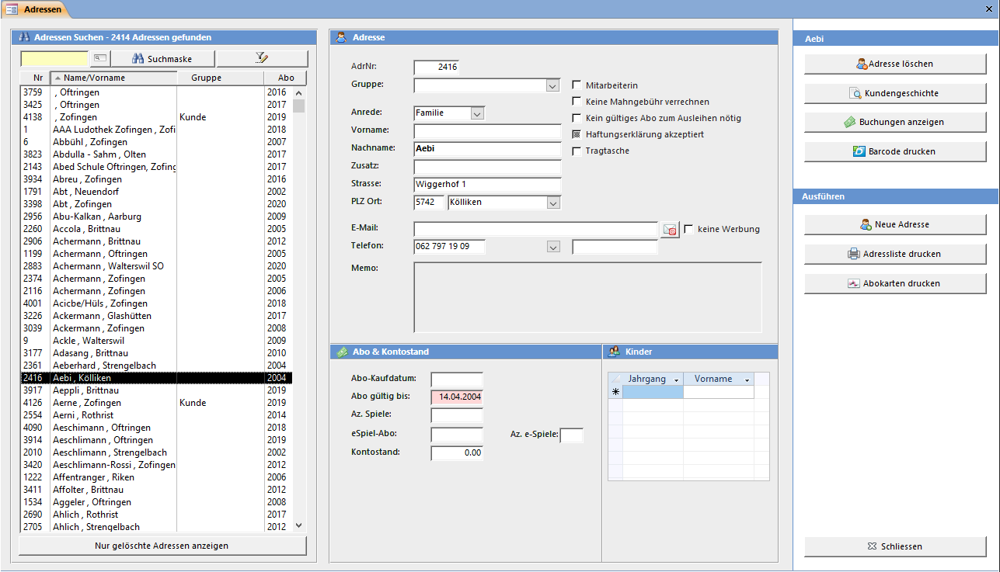
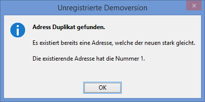

Das "Adressen"-Fenster können Sie mit der "Übersicht" oder der "Symbolleiste" öffnen.

#### Adressen suchen

Tippen Sie die Adressnummer oder einen Teil des Nachnamens in das gelbe Suchfeld ein. Auf der rechten Seite im Fenster wird die gefundene Adresse angezeigt.

#### Mitarbeiter

Wenn das Feld angewählt ist, dann ist die Adresse ein Mitarbeiter. Ein Mitarbeiter zahlt z.B. keine Spielgebühren (Wenn so eingestellt) Nur Mitarbeiter können im **Arbeitsrapport** erfasst werden.

#### Kürzel

Das Kürzel / Visum der Mitarbeiterin welches bei der Spielausleihe, Rückgabe oder Buchung angezeigt wird. Ist nichts eingetragen wird das Kürzel automatisch aus den Initialen erstellt.

#### Keine Mahngebühr verrechnen

Falls bei gewissen Kunden (z.B. Institutionen) keine Mahngebühr verrechnet werden soll kann dies hier definiert werden.

#### Keine Werbung

Falls der Kunde keine Werbe-Newsletter auf seine Emailadresse wünscht.

#### Anzahl Spiele / Anzahl eSpiele

Falls die maximale Anzahl ausgeliehener Spiele (pro Kunde) beschränkt ist, dann kann dies mit den Feldern Az. Spiele und Az. eSpiele erreicht werden. Das Feld Az. Spiele ist die Gesamtanzahl und enthält die eSpiele. Ist nur bei Az. eSpiele etwas eingetragen sind nur diese beschränkt und es können beliebig viele andere Spiele ausgeliehen werden.

>>>> Die Az. Spiele können beim Abo vordefiniert werden. Wird ein Abo dem Kunden verkauf, dann werden die Nummern zum Kunden **kopiert**. Nachträgliche Änderungen in der Abo-Definition wirken sich nicht auf Kunden mit bereits zuvor erfassten Abos aus.

#### Konto

Das Konto des Kunden. Ist der Kontostand negativ, hat der Kunde bei der Ludothek Schulden. Der Kunde kann auch einen positiven Kontostand haben (Er hat eine Vorauszahlung geleistet und somit ein Guthaben). Der Button hinter dem Kontostand-Textfeld zeigt ein Fenster mit allen Buchungen des Kunden an.

>>>> Änderungen am Kontostand verursachen keine Buchung im Journal. Um den Kontostand korrekt zu ändern, muss dies mit einer Buchung im Fenster **Einnahmen und Rückerstattungen** (im Ausleihfenster) oder **Einzelbuchung** erledigt werden.

#### Ausleihkonto

Das Ausleihkonto kann keinen negativen Kontostand haben. Solange ein positiver Ausleihkontostand vorhanden ist werden die Spielgebühren (beim Ausleihen und Verlängern) abgebucht.

#### Kinder

In dieses Feld können die Kinder mit Vorname und Geburtsdatum / Jahrgang oder die Anzahl Familienmitglieder eingegeben werden.

>>>
**Einstellung**  
Falls Sie die Kinder der Familie nicht erfassen möchten, so kann diese Tabelle unter **Einstellungen => Diverses** ausgeblendet werden.

#### Neue Adresse

Beim Erfassen einer neuen Adresse wird automatisch die nächst Grösste Nummer vorgeschlagen, jedoch kann auch eine andere, nicht bereits vergebene, Nummer der neuen Adresse zugeteilt werden.

#### Adresse Löschen / Wiederherstellen

Adressen können gelöscht bzw. deaktiviert werden. Wenn Sie eine Adresse löschen, verschwindet diese aus allen Adresslisten. Sie wird aber nur komplett aus der Datenbank gelöscht, wenn mit dieser Adresse nie ein Spiel ausgeliehen wurde, ansonsten wird die Adresse nur versteckt (aus statistischen Gründen).

Versteckte Adressen können Sie anzeigen, indem Sie den Knopf Nur gelöschte Adressen anzeigen unterhalb der Suchliste drücken. Um die Adresse wiederherzustellen drücken Sie den Knopf Adresse wiederherstellen.

#### Adressen endgültig löschen

Im LUPO-Admin Fenster steht eine Funktion zum endgültigen Löschen der Adressen zur Verfügung.

#### Automatische Prüfung auf doppelte Adressen

Wenn Sie eine Adresse erfassen und Name, Vorname und Strasse der neuen Adresse identisch mit einer bereits gespeicherten Adresse sind, erscheint bereits während der Eingabe der Daten folgende Meldung:

