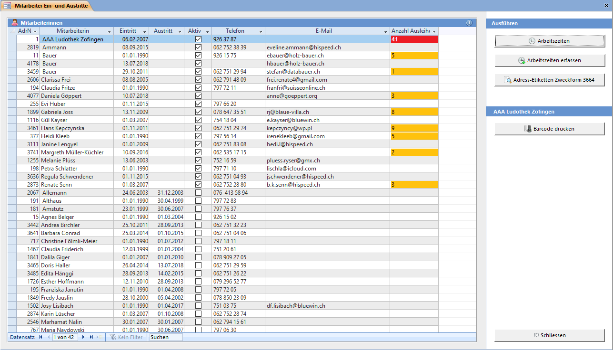

Öffnen Sie dieses Fenster mit **Übersicht => Adressen, Spiele und Mitarbeiter => Mitarbeiter**

Wenn Sie im **Adressen**-Fenster das Mitarbeiterin Kontrollkästchen aktivieren, wird die Mitarbeiterin in der Liste oberhalb eingetragen.

Um einen Eintrag zu löschen den Datensatz markieren und mit **[Delete]** löschen. Dabei wird die Mitarbeiterin **NUR** aus dieser Liste gelöscht, der Mitarbeiterinnen-Status (das Häkchen) der Adresse und die Adresse selbst bleibt dabei erhalten.

#### Adressetiketten

Öffnet den Adressetiketten-Bericht in Seitenansicht. Um nur aktive Mitarbeiterinnen angezeigt zu bekommen, müssen zuerst im Datenblatt die aktiven Datensätze gefiltert werden.
