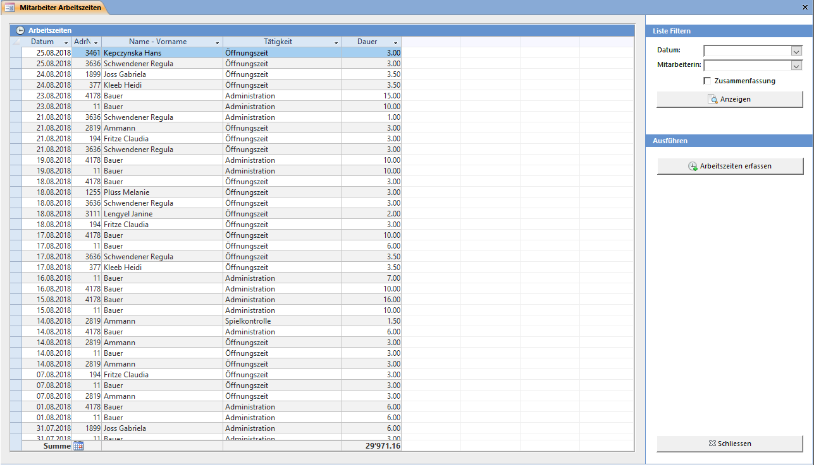
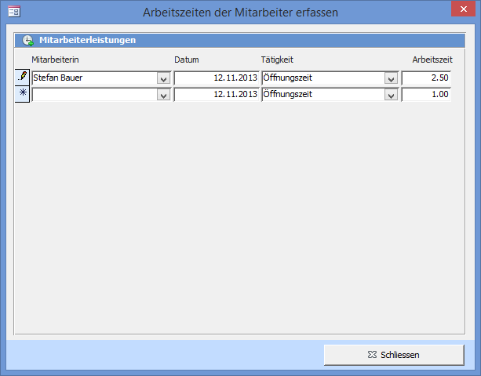

Das **Mitarbeiter Arbeitszeiten** Fenster kann mit dem Übersichtsbefehl **Übersicht => Adressen, Spiele und Mitarbeiter => Arbeitszeiten** geöffnet werden.

Sind bereits Arbeitszeiten im aktuellen Monat erfasst worden, so werden diese automatisch gefiltert. In den Filter-Feldern kann ein Monat oder ein ganzes Jahr sowie zusätzlich eine Mitarbeiterin ausgewählt werden.

Anzeigen öffnet den Bericht mit den gefilterten Arbeitszeiten. Ist das Häkchen Zusammenfassung gesetzt, so werden die Arbeitszeiten pro Mitarbeiterin summiert.

Arbeitszeiten erfassen öffnet dasselbe Fenster welches auch vom Beenden-Assistent her geöffnet werden kann.

Sie können einen Mitarbeiter und die Tätigkeit auswählen und die Arbeitszeit eintragen (2.50 = 2h 30min). Die Einträge erscheinen auf dem Tagesjournal-Ausdruck.
