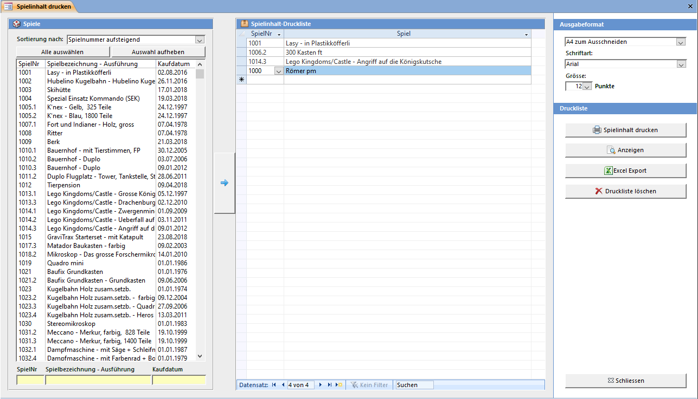

Das **Spielinhalt Drucken** Fenster kann über die **Übersicht → Drucken → Spielinhalt drucken** geöffnet werden.

#### Spielsuchliste (Links im Fenster)

Suchen Sie die Spiele mit Hilfe der gelben Suchfelder in der Spielliste und markieren Sie die gewünschten Spiele. Mehrere Spiele auf einmal können Sie durch Klicken und gleichzeitiges Halten von <kbd>Ctrl</kbd> auswählen. Die markierten Spiele werden durch Drücken des Pfeil Buttons in die Barcode Druckliste aufgenommen.

Mit den Buttons Alle auswählen und Auswahl aufheben können Sie alle Elemente in der Liste an bzw. abwählen.

Folgende Sortier-Möglichkeiten stehen zur Verfügung:

!!! Verwenden Sie im Suchfeld das Platzhalterzeichen * (Stern) für beliebig viele, das ? (Fragezeichen) für genau ein unbekanntes Zeichen. Beispiel: Wenn Sie alle Spiele mit dem Kaufdatum im Februar 2020 anzeigen wollen, können Sie ??.02.2020 oder *.02.2020 eingeben

#### Ausgabeformat

Definieren Sie die Schriftart, -grösse und das Format des Spielinhaltes. In den Einstellungen können die Vorgabewerte definiert werden.

Druckliste löschen löscht alle in der Druckliste angezeigten Spiele. Einzelne (oder mehrere) Einträge in der Liste können Sie durch markieren und anschliessendem Drücken von <kbd>Delete</kbd> aus der Liste löschen.

Spielinhalt drucken druckt die Barcodes der in der Druckliste aufgeführten Spiele auf den Standard-Drucker. Um einen anderen Drucker oder z.B. den manuellen Papiereinzug angeben zu können, öffnen Sie das Dokument mit Anzeigen. Falls als Ausgabeformat ein Etikett gewählt wurde, kann angegeben werden, bei welcher Etiketten-Position der Druck beginnen soll.
