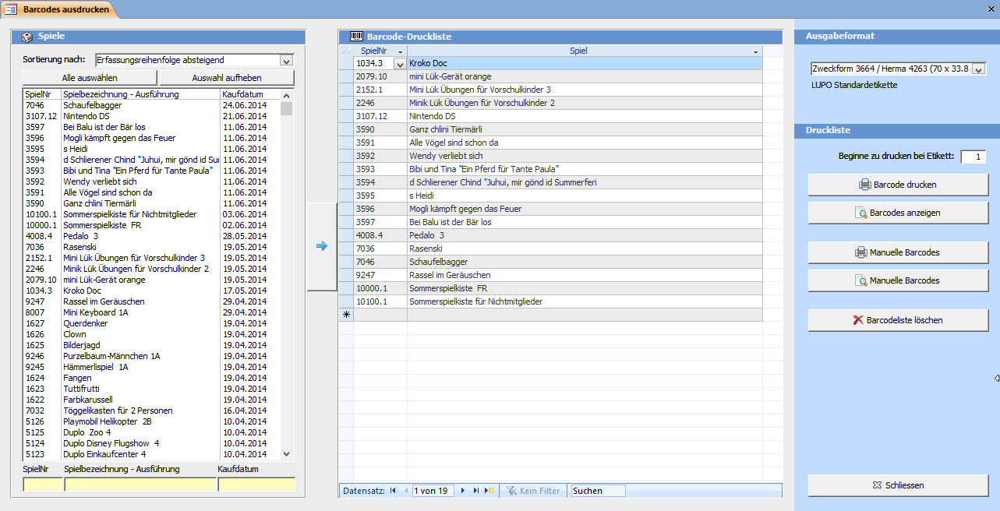
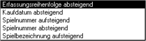
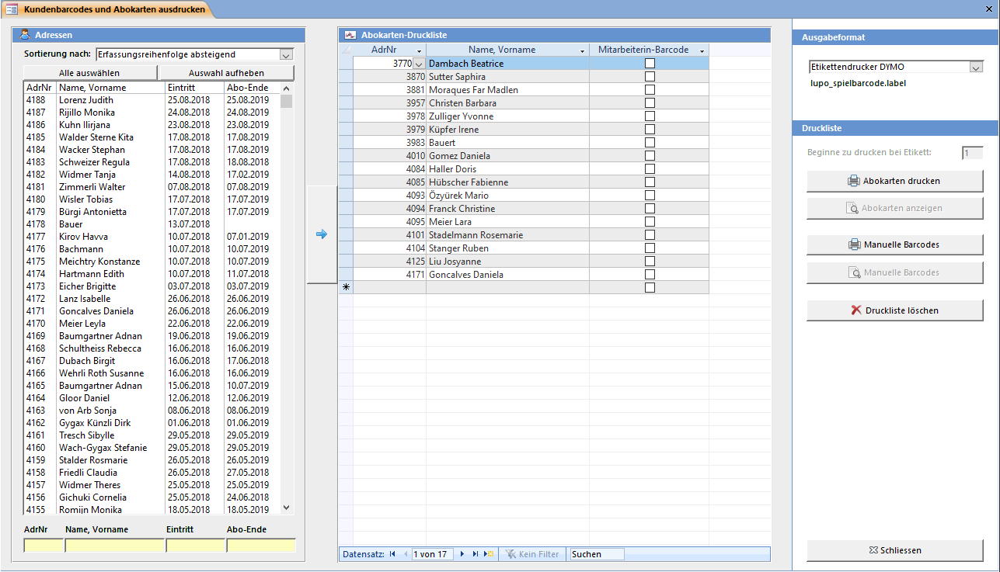

Das **Barcode Drucken** Fenster kann über die **Übersicht => Drucken => Barcodes Drucken** geöffnet werden.

#### Spielsuchliste (Links im Fenster)

Suchen Sie die Spiele mit Hilfe der gelben Suchfelder in der Spielliste und markieren Sie die gewünschten Spiele. Mehrere Spiele auf einmal können Sie durch Klicken und gleichzeitiges Halten der Taste **[Ctrl]** oder **[Shift]** auswählen.

Die markierten Spiele können Sie durch Drücken des Pfeil Buttons in die Barcode Druckliste aufnehmen.   
Mit den Buttons Alle auswählen und Auswahl aufheben können alle Elemente in der Liste an bzw. abwählt werden.

Folgende Sortier-Möglichkeiten stehen zur Verfügung:

>>>>> Verwenden Sie im Suchfeld das **Platzhalterzeichen * (Stern)** für beliebig viele, das **? (Fragezeichen)** für genau ein unbekanntes Zeichen. Beispiel: Wenn Sie alle Spiele mit dem Kaufdatum im Februar 2014 anzeigen wollen, können Sie **??.02.2014** oder ***.02.2014** eingeben.

Barcodeliste löschen löscht alle in der Druckliste angezeigten Barcodes. Einzelne (oder mehrere) Einträge in der Liste können Sie durch markieren und anschliessendem Drücken von **[Del]** aus der Liste löschen.

Barcode Drucken druckt die Barcodes der in der Druckliste aufgeführten Spiele auf den Standard-Drucker. Um einen anderen Drucker oder z.B. den manuellen Papiereinzug angeben zu können muss sie Liste in der Seitenansicht angezeigt werden. Wenn Sie den Ausdruck nicht beim ersten Barcode-Etikett beginnen wollen, können Sie das Etikett, bei welchem der Druck gestartet werden soll, in das Textfeld oben links eintragen.

Es können nicht nur Barcodes für bestehende Spiele ausgedruckt werden, sondern für jede x-beliebige Nummer. Wenn Sie den Knopf Manuelle Barcodes drücken, werden Sie aufgefordert den Nummernbereich für die zu druckenden Strichcodes einzugeben.

## Abokarten drucken

Dieses Fenster kann mit **Übersicht => Drucken => Abokarten Drucken** geöffnet werden.

#### Adresssuchliste

Suchen Sie die Adressen mit Hilfe der gelben Suchfelder unterhalb der Adressliste und markieren Sie die gewünschten Adressen. Mehrere auf einmal können Sie durch Klicken und gleichzeitiges Halten der Taste **[Ctrl]** oder **[Shift]** ausgewählt werden. Die gewählten Adressen können Sie durch Drücken des Pfeil Buttons in die Barcode Druckliste aufnehmen, einzelne Einträge durch einen Doppelklick.

Mit den Buttons Alle auswählen und Auswahl aufheben können Sie alle Elemente in der Liste an bzw. abwählen.

 
>>>>> Verwenden Sie im Suchfeld das **Platzhalterzeichen * (Stern)** für beliebig viele, das **? (Fragezeichen)** für genau ein unbekanntes Zeichen. Beispiel: Wenn Sie alle Kunden mit dem Eintrittsdatum im Februar 2014 anzeigen wollen, können Sie **??.02.2014** oder ***.02.2014** eingeben.

Druckliste löschen löscht alle in der Druckliste angezeigten Barcodes. Einzelne (oder mehrere) Einträge in der Liste können Sie durch markieren und anschliessendem Drücken der Taste **[Del]** aus der Liste löschen.

Barcode Drucken druckt die Abokarten der in der Druckliste aufgeführten Adressen auf den Standard-Drucker. Um einen anderen Drucker oder z.B. den manuellen Papiereinzug angeben zu können muss die Liste in der Seitenansicht angezeigt werden. Wenn Sie den Ausdruck nicht beim ersten Barcode-Etikett beginnen wollen, können Sie das Etikett bei welchem der Druck gestartet werden soll in das Textfeld oben rechts eintragen.

Manuelle Barcodes druckt ‚leere' Kunden-Barcodes für Kundennummern die noch gar nicht vergeben sind. Sie werden aufgefordert den Nummernbereich für die zu druckenden Strichcodes einzugeben.