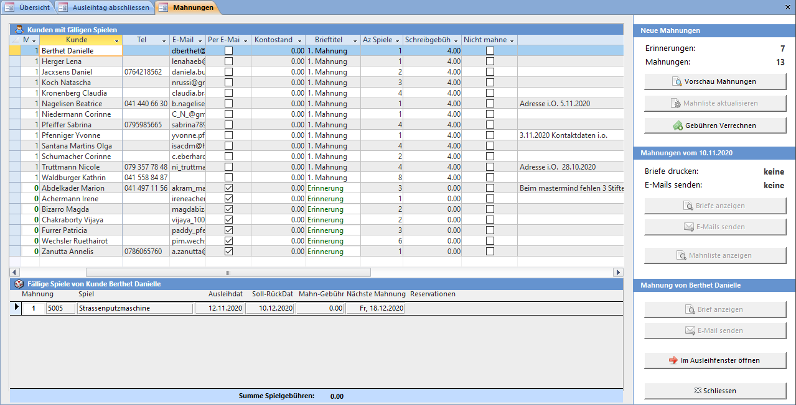
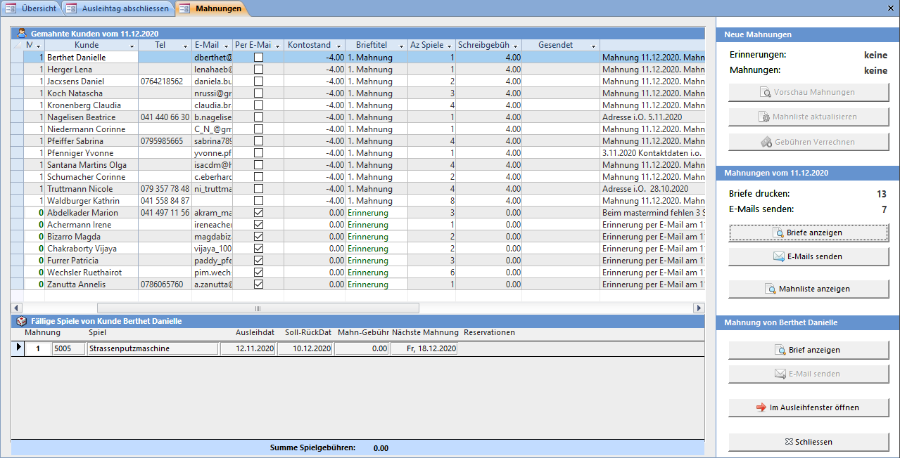

Das **Mahnungen drucken** Fenster kann mit der **Übersicht** oder beim **Beenden** von LUPO geöffnet werden.

Neue Mahnungen können für Spiele erstellt werden, deren Mahndatum in der Vergangenheit liegt.
Erinnerungen werden erstellt, wenn das Rückgabedatum in weniger als die bei den Einstellungen definierte Anzahl Tage liegt.
Bis eine Erinnerung oder Mahnung gedruckt oder per E-Mail versendet werden kann, sind vier Schritte vorzunehmen:

!! Mahnungen müssen nach dem Ausleihtag erstellt werden. Sonst ist der Kunde bereits gemahnt, auch wenn er das Spiel noch am selben Tag zurückbringt.

### 1\. Mahnliste aktualisieren

Beim Aktualisieren der Mahnliste werden alle fälligen Spiele gefunden und nach Kunden gruppiert aufgelistet.

**ACHTUNG**: Beim Aktualisieren der Mahnliste werden die bestehenden Mahnungen überschrieben!

### 2\. Mahnliste kontrollieren

Alle Kunden in der oberen Liste erhalten eine Mahnung. Soll ein Kunde nicht gemahnt werden, so muss ein Häkchen in der Spalte **Nicht mahnen** gesetzt werden.

### 3\. Gebühren Verrechnen

Nachdem Sie die Gebühren verrechnet haben, können die Briefe angezeigt und E-Mails gesendet werden.

### 4\. Mahnbriefe drucken / E-Mails senden

Zeigt die berechneten Mahnungen (Briefe) in Seitenansicht an bzw. sendet das E-Mail. Das Aussehen des Briefes und der Mahntext kann im Fenster **Briefeinstellungen** angepasst werden.

#### Mahnliste drucken

Zeigt eine Liste mit allen neu gemahnten Kunden und eine Liste der gemahnten Spiele in Seitenansicht an.

!!! Die Anzahl Tage bis eine (weitere) Mahnung erstellt wird ist in den **Einstellungen** definiert. Eine erstellte Mahnung kann kein zweites Mal berechnet werden. Eine weitere (z.B. 2. Mahnung) wird erst nach Ablauf der Toleranztage (Die 2. Mahnung ist fällig) erstellt.
