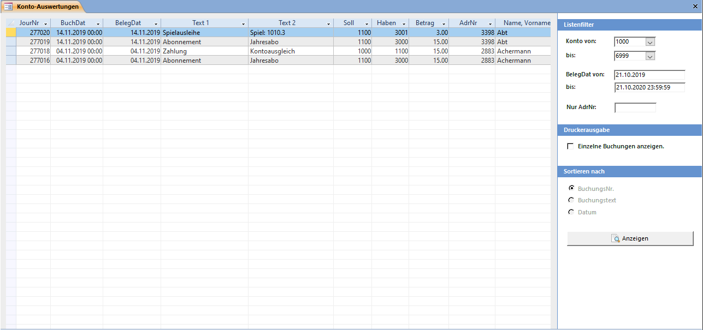

Das Fenster **Konto-Auswertung** können Sie mit dem Übersichtsbefehl **Buchhaltung => Konto-Auswertung** öffnen.

Sie können die Liste filtern nach Kontonummer und / oder Buchungsdatum.

#### Konto von ... bis ...

Die Kontennummern, welche sie anzeigen wollen (Bsp. 1000 – 2999 = Aktiven /Passiven).

#### Datum von ... bis ...

Der Datumsbereich, über welchen sie die Konti anzeigen wollen.

>>>>> Es wird mit der genauen Zeit gerechnet. Wenn Sie in beide Felder das gleiche Datum eingeben, werden keine Buchungen angezeigt.

#### Druckerausgabe

Klicken Sie auf Einzelne Buchungen anzeigen um die Sortierung zu bestimmen. Sie können die Kontenblätter nach Buchungsnummer, Buchungstext oder Datum sortieren. Geben Sie die Adressnummer in das Feld AdrNr ein, um nur die Buchungssätze, einer Adresse angezeigt zu bekommen.

Wenn Sie auf Anzeigen klicken, werden die Kontenblätter in der Seitenansicht angezeigt.
