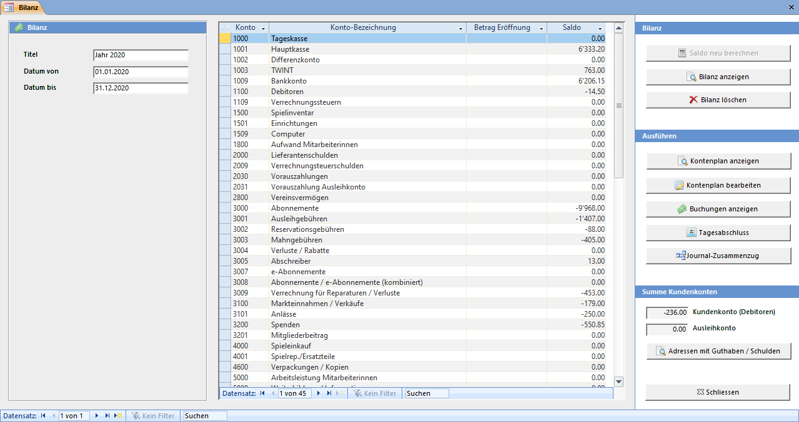

Das Fenster **Bilanz** kann mit dem Übersichtsbefehl **Buchhaltung → Bilanz** geöffnet werden.

### Kontenplan

Der von LUPO verwendete Kontenplan entspricht mehr oder weniger einem KMU-Kontenrahmen.

!! Sie dürfen die Kontobezeichnungen anpassen (z.B. Hauptkasse in PC-Konto ändern) und neue Konten erfassen. Die bestehenden Kontonummern dürfen aber nicht verändert werden.

|  **Konto** | **Konto Bezeichnung** | **Buchhaltungsklasse** |  **Konntengruppe** | 
| --- | --- |--- |--- |
| 1000 | Tageskasse | 100 flüssige Mittel | Aktiven | 
| 1001 | Hauptkasse | 100 flüssige Mittel | Aktiven | 
| 1002 | Differenzkonto | 100 fküssige Mittel | Aktiven | 
| 1009 | Bankkonto | 100 flüssige Mittel | Aktiven | 
| 1100 | Debitoren | 110 Forderungen | Aktiven | 
| 1109 | Verrechnungssteuern | 110 Forderungen | Aktiven | 
| 1500 | Spielinventar | 150 Mobile Sachanlagen | Aktiven | 
| 1501 | Einrichtungen | 150 Mobile Sachanlagen | Aktiven | 
| 1509 | Computer | 150 Mobile Sachanlagen | Aktiven | 
| 1800 | Aufwand Mitarbeiterinnen | 180 aktivierter Aufwand / Berichtigungen | Aktiven | 
| 2000 | Lieferantenschulden | 200 Kreditoren | Passiven | 
| 2009 | Verrechnungsteuerschulden | 200 Kreditoren | Passiven | 
| 2030 | Vorauszahlungen | 203 Kreditoren | Passiven | 
| 2031 | Vorauszahlung Ausleihkonto | 203 Kreditoren | Passiven | 
| 2800 | Vereinsvermögen | 280 Kapital | Passiven | 
| 3000 | Abonnements | 300 Ausleihen | Ertrag | 
| 3001 | Ausleihgebühren | 300 Ausleihen | Ertrag | 
| 3002 | Reservationsgebühren | 300 Ausleihen | Ertrag | 
| 3003 | Mahngebühren | 300 Ausleihen | Ertrag | 
| 3004 | Verlust Ausleihgebührenrabatte | 300 Ausleihen | Ertrag | 
| 3007 | e-Abonnemente | 300 Ausleihen | Ertrag | 
| 3009 | Abonnemente / e-Abonnemente (kombi.) | 300 Ausleihen | Ertrag | 
| 3009 | Verrechnung für Reparaturen / Verluste | 300 Ausleihen | Ertrag | 
| 3100 | Markteinnahmen / Verkäufe | 310 Übrige Einnahmen | Ertrag | 
| 3200 | Spenden | 320 Mitgliederbeiträge | Ertrag | 
| 3201 | Mitgliederbeitrag | 320 Mitgliederbeiträge | Ertrag | 
| 4000 | Spieleinkauf | 400 Spielkauf | Aufwand Spiele / Material | 
| 4001 | Spielreparatur / Ersatzteile | 400 Spielkauf | Aufwand Spiele / Material | 
| 4600 | Verpackungen / Kopien | 460 Verpackungsmaterial / Kopien | Aufwand Spiele / Material | 
| 5000 | Arbeitsleistung Mitarbeiterinnen | 500 Leistungen Mitarbeiterinnen | Aufwand Mitarbeiterinnen | 
| 5800 | Weiterbildung / Information | 580 Weiterbildung / Vereinsanlässe | Aufwand Mitarbeiterinnen | 
| 5809 | Ausflug / Geschenke | 580 Weiterbildung / Vereinsanlässe | Aufwand Mitarbeiterinnen | 
| 6300 | Versicherungen | 630 Versicher. / Abgaben / Bewilligungen | Sonstiger Aufwand | 
| 6301 | Bewilligungen | 630 Versicher. / Abgaben / Bewilligungen | Sonstiger Aufwand | 
| 6500 | Büromaterial | 650 Büromaterial / Telefon / Beiträge | Sonstiger Aufwand | 
| 6501 | Telefon / Porti | 650 Büromaterial / Telefon / Beiträge | Sonstiger Aufwand | 
| 6507 | Beiträge | 650 Büromaterial / Telefon / Beiträge | Sonstiger Aufwand | 
| 6509 | EDV / Computer | 650 Büromaterial / Telefon / Beiträge | Sonstiger Aufwand | 
| 6600 | Inserate | 660 Werbung | Sonstiger Aufwand | 
| 6800 | Zinsen / Spesen | 680 Zinsen und Spesen | Sonstiger Aufwand | 
| 6900 | Amortisation Spiele | 690 Abschreibungen | Sonstiger Aufwand | 
| 6901 | Amortisation Einrichtungen | 690 Abschreibungen | Sonstiger Aufwand | 
| 8000 | Ausgleichkonto Bestände erfassen | 800 Bestände | Bestände |

#### Kontenplan anzeigen

Zeigt den Kontenplan in Seitenansicht an.

#### Kontenplan bearbeiten

Öffnet die Tabelle um Konten und Kontenbezeichnungen zu bearbeiten.

#### Buchungen anzeigen

Öffnet das Fenster für Kontoauswertungen. Dort können alle gespeicherten Buchungen nach Zeitspanne oder Kontonummer gefiltert werden. 

#### Tagesabschluss

Wechselt zum Fenster Tagesabschluss.

#### Journal-Zusammenzug

Tagesjournale über eine Zeitspanne zusammenfassen oder Buchungen für Banana exportieren.

### Summe Kundenkonten

Hier ist auf einen Blick ersichtlich welche Summe die Kunden der Ludothek noch schulden (z.B. offene Mahngebühren) und wie viel Geld insgesamt noch auf den Ausleih-Kundenkonten ist. Der Knopf Adressen mit Guthaben / Schulden öffnet einen Bericht, in welchem entsprechenden Kunden aufgelistet sind.
