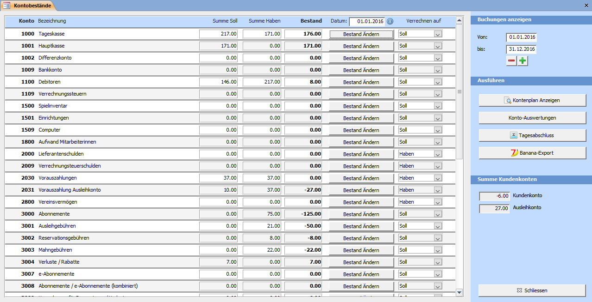
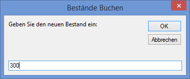

Das Fenster **Kontobestände** können Sie mit dem Übersichtsbefehl **Buchhaltung => Kontobestände** öffnen.

Es werden alle Soll-Beträge und alle Haben-Beträge aller jemals gespeicherten Buchungen im Journal zusammengezählt. Der Bestand bildet sich aus **[Summe Haben] – [Summe Soll]**.

#### Bestand ändern

Geben Sie den neuen Bestand ein. Je nach Konto wird der Differenzbetrag auf das Haben- oder Sollkonto verrechnet. Die Gegenbuchung wird entsprechend dem Hilfskonto (8000) belastet.

#### Kontenplan anzeigen

Zeigt den Kontenplan in Seitenansicht an.

#### Konto-Auswertungen

Öffnet das Fenster für Kontoauswertungen.

#### Tagesabschluss

Wechselt zum Fenster Tagesabschluss.

#### Banana-Export

Exportiert alle Buchungen der ausgewählten Zeitspanne ins Textdatei-Format des Buchhaltungsprogrammes Banana. Diese Datei kann dann anschliessend im Banana über den Menübefehl Daten => Zeilen importieren eingelesen werden.

Damit die Konten in Banana mit denen im LUPO korrespondieren, sollte die Buchhaltung auf der bei der LUPO Installation nach C:Lupo_Daten kopierten Datei **buchhaltung-lupo.ac2** basieren.

### Kontenplan

Der von LUPO verwendete Kontenplan entspricht einem KMU Kontenrahmen (nach Käfer).

!! Sie dürfen die Kontobezeichnungen anpassen (z.B. Hauptkasse in PC-Konto ändern) und neue Konten erfassen. Die bestehenden Kontonummern dürfen aber nicht verändert werden.

| **Buchhaltungsklasse** |  **Konntengruppe** |  **Konto Bezeichnung** |  **Konto** |
| --- | --- |--- |--- |
| Aktiven |  100 flüssige Mittel |  Tageskasse |  1000 |  
| Aktiven |  100 flüssige Mittel |  Hauptkasse |  1001 |  
| Aktiven |  100 fküssige Mittel |  Differenzkonto |  1002 |  
| Aktiven |  100 flüssige Mittel |  Bankkonto |  1009 |  
| Aktiven |  110 Forderungen |  Debitoren |  1100 |  
| Aktiven |  110 Forderungen |  Verrechnungssteuern |  1109 |  
| Aktiven |  150 Mobile Sachanlagen |  Spielinventar |  1500 |  
| Aktiven |  150 Mobile Sachanlagen |  Einrichtungen |  1501 |  
| Aktiven |  150 Mobile Sachanlagen |  Computer |  1509 |  
| Aktiven |  180 aktivierter Aufwand / Berichtigungen |  Aufwand Mitarbeiterinnen |  1800 |  
| Passiven |  200 Kreditoren |  Lieferantenschulden |  2000 |  
| Passiven |  200 Kreditoren |  Verrechnungsteuerschulden |  2009 |  
| Passiven |  203 Kreditoren |  Vorauszahlungen |  2030 |  
| Passiven |  203 Kreditoren |  Vorauszahlung Ausleihkonto |  2031 |  
| Passiven |  280 Kapital |  Vereinsvermögen |  2800 |  
| Ertrag |  300 Ausleihen |  Abonnements |  3000 |  
| Ertrag |  300 Ausleihen |  Ausleihgebühren |  3001 |  
| Ertrag |  300 Ausleihen |  Mahngebühren |  3003 |  
| Ertrag |  300 Ausleihen |  Verlust Ausleihgebührenrabatte |  3004 |  
| Ertrag |  300 Ausleihen |  e-Abonnemente |  3007 |  
| Ertrag |  300 Ausleihen |  Abonnemente / e-Abonnemente (kombi.) |  3009 |  
| Ertrag |  300 Ausleihen |  Verrechnung für Reparaturen / Verluste |  3009 |  
| Ertrag |  310 Übrige Einnahmen |  Markteinnahmen / Verkäufe |  3100 |  
| Ertrag |  320 Mitgliederbeiträge |  Spenden |  3200 |  
| Ertrag |  320 Mitgliederbeiträge |  Mitgliederbeitrag |  3201 |  
| Aufwand Spiele / Material |  400 Spielkauf |  Spieleinkauf |  4000 |  
| Aufwand Spiele / Material |  400 Spielkauf |  Spielreparatur / Ersatzteile |  4001 |  
| Aufwand Spiele / Material |  460 Verpackungsmaterial / Kopien |  Verpackungen / Kopien |  4600 |  
| Aufwand Mitarbeiterinnen |  500 Leistungen Mitarbeiterinnen |  Arbeitsleistung Mitarbeiterinnen |  5000 |  
| Aufwand Mitarbeiterinnen |  580 Weiterbildung / Vereinsanlässe |  Weiterbildung / Information |  5800 |  
| Aufwand Mitarbeiterinnen |  580 Weiterbildung / Vereinsanlässe |  Ausflug / Geschenke |  5809 |  
| Sonstiger Aufwand |  630 Versicher. / Abgaben / Bewilligungen |  Versicherungen |  6300 |  
| Sonstiger Aufwand |  630 Versicher. / Abgaben / Bewilligungen |  Bewilligungen |  6301 |  
| Sonstiger Aufwand |  650 Büromaterial / Telefon / Beiträge |  Büromaterial |  6500 |  
| Sonstiger Aufwand |  650 Büromaterial / Telefon / Beiträge |  Telefon / Porti |  6501 |  
| Sonstiger Aufwand |  650 Büromaterial / Telefon / Beiträge |  Beiträge |  6507 |  
| Sonstiger Aufwand |  650 Büromaterial / Telefon / Beiträge |  EDV / Computer |  6509 |  
| Sonstiger Aufwand |  660 Werbung |  Inserate |  6600 |  
| Sonstiger Aufwand |  680 Zinsen und Spesen |  Zinsen / Spesen |  6800 |  
| Sonstiger Aufwand |  690 Abschreibungen |  Amortisation Spiele |  6900 |  
| Sonstiger Aufwand |  690 Abschreibungen |  Amortisation Einrichtungen |  6901 |  
| Bestände |  800 Bestände |  Ausgleichkonto Bestände erfassen |  8000 | 
