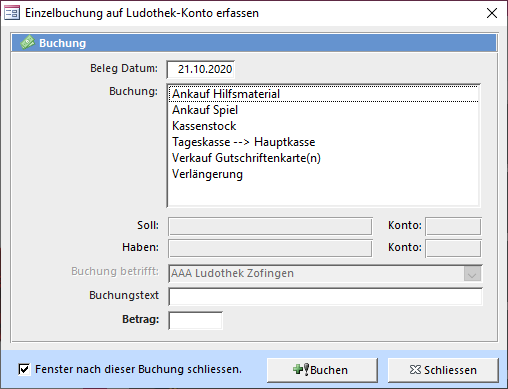

Das **Einzelbuchung** Fenster können Sie mit **Übersicht => Buchhaltung => Manuell buchen** öffnen.

#### Buchung

Auswählen des vordefinierten Buchungssatzes. Buchungssätze können unter **Übersicht => Buchhaltung => Buchungstexte bearbeiten** erstellt oder bearbeitet werden.

#### Buchung betrifft

Buchungen die in diesem Fenster ausgeführt werden beziehen sich immer auf die Ludothek. Wollen Sie eine Buchung durchführen, welche dem Kunden einen Betrag auf seinem Konto belastet, so müssen Sie dies über Einzelbuchung im Spiele ausleihen und zurücknehmen Fenster durchführen.