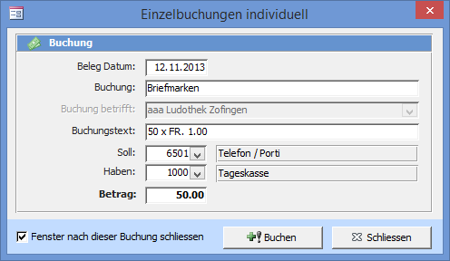

Das **Einzelbuchungen individuell** Fenster können Sie mit dem Übersichtsbefehl **Übersicht => Buchhaltung => Manuell buchen (individuell)** öffnen.

Im **Einzelbuchung individuell** Fenster können Sie Buchungen von einem frei wählbaren Konto nach einem frei wählbaren Konto erfassen. Hier übernimmt der Computer keine Kontrolle über Ihre Buchungen. Was Sie eingeben wird gebucht!

