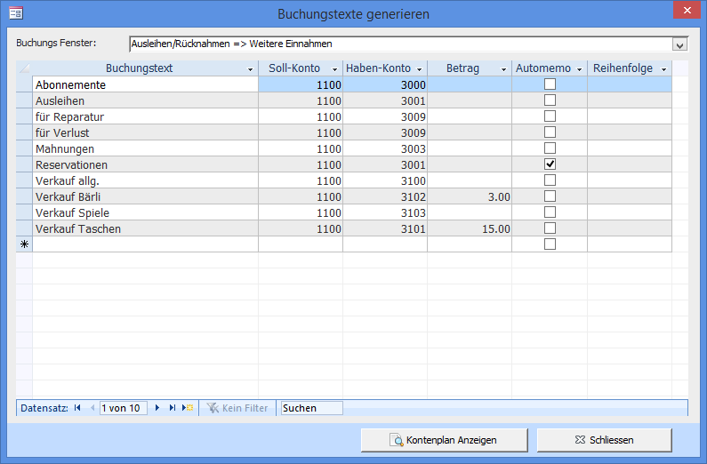

Das Fenster **Buchungstexte** können Sie mit **Übersicht → Buchhaltung → Buchungstexte bearbeiten** öffnen. Diese Buchungstexte sind die Auswahlmöglichkeiten in den **Buchen – Fenster** (Spiele ausleihen und zurücknehmen und Einzelbuchungen (manuell buchen)).

#### Buchungs-Fenster

Es kann ausgewählt werden für welches Fenster der Text vordefiniert werden soll: Spiele ausleihen und zurücknehmen oder Einzelbuchungen (manuell buchen)

#### Buchungstext

Der Buchungstext wird hier vorgegeben. Jeder Buchung kann ein zweiter Text angefügt werden.

#### Soll-Konto (Ein)

Aus dem Kontenplan muss ein Konto für die Soll-Buchung gewählt werden.

#### Haben-Konto (Aus)

Aus dem Kontenplan muss ein Konto für die Haben-Buchung gewählt werden.

#### Betrag

Wenn ein Betrag erfasst ist, so wird dieser im Buchungsfenster automatisch eingetragen. Falls der Kunden z.B. Buttons für die Buttonmaschine kaufen kann und zehn Stück Fr. 5.- kosten kann dies so erfasst werden.

#### Automemo

Wenn angewählt, dann wird bei einer Buchung im Ausleihfenster automatisch die Checkbox Buchungstext ins Memofeld eintragen gesetzt.

#### Reihenfolge

In dieser Reihenfolge werden die Buchungen angezeigt. Ist nichts eingetragen so wird die Liste alphabethisch sortiert.
