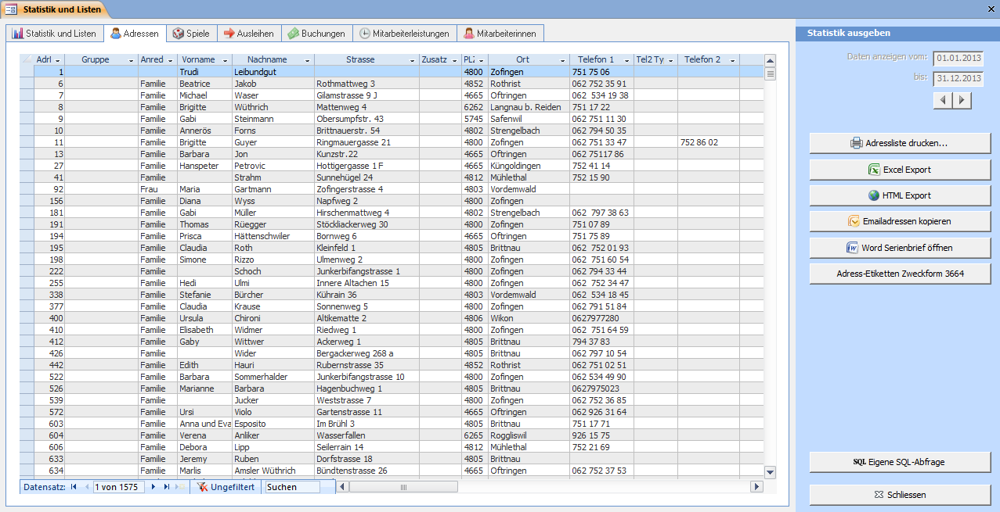
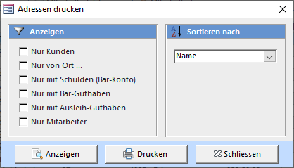
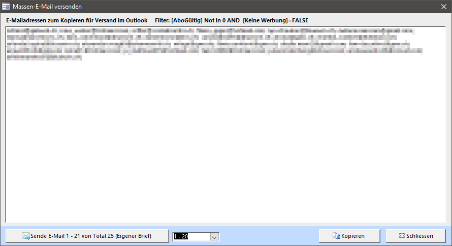
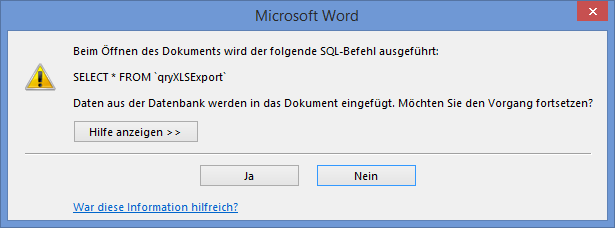

Die Liste zeigt alle aktiven Adressen. Gelöschte Adressen werden nicht angezeigt.

Mit Adress-Etiketten Zweckform 3664 werden alle angezeigten Adressen (ihr Filter wird beachtet!) in Seitenansicht zum Drucken auf Etiketten angezeigt.

>>>>>> In allen Listen können Sie die Datensätze sortieren und filtern und in die Zwischenablage kopieren. Um den Listeninhalt zu kopieren, markieren Sie alle Datensätze indem Sie auf die linke Ecke oben in der Liste klicken. Danach drücken Sie **[Ctrl]+[c]** um die Daten in die Zwischenablage zu kopieren und danach in ein anderes Programm wie z.B. Word oder Excel um und von dort her formatiert auszudrucken, als Serienbrief-Datenquelle oder sonst wie zu nutzen.

### Adressliste drucken

Das **Adressen drucken** Fenster kann mit **Adressliste drucken** geöffnet werden:

Bestimmen sie durch ankreuzen der entsprechenden Optionen welche Adressen angezeigt werden sollen. Gewisse Optionen können miteinander kombiniert werden.

### Email Massenversand

Wenn Sie auf Emailadressen kopieren klicken, werden Sie aufgefordert die Paketgrösse der Emailadressen anzugeben. Die meisten Emailanbieter akzeptieren nur eine bestimmte Anzahl Email-Adressen in einem Email (zum Schutz vor Spamversand). Geben Sie deshalb eine Zahl kleiner als 100 ein. Es werden alle Emailadressen der Adressliste in Blöcke an X Emailadressen aufgelistet. Erstellen Sie für jeden Block eine einzelne Email. Die Emailadressen sollten Sie in das BCC-Feld (Blindkopie) kopieren.

Falls Sie im Adress-Datenblatt einen Filter gesetzt haben wird dieser berücksichtigt.

### Serienbrief in Word

Bei der Installation des LUPO wird die Serienbrief-Vorlage **C:\Lupo_Daten\Serienbrief.dotx** kopiert. Der Knopf Word Serienbrief öffnen exportiert alle angezeigten Adressen (gesetzte Filter werden beachtet) in die Datei **C:\Lupo_Daten\Serienbrief_Datenquelle.docx** und öffnet ein neues Dokument basierend auf der Vorlage in Microsoft Word (sofern installiert).

Bevor der Serienbrief angezeigt wird muss folgende Frage mit Ja bestätigt werden:

