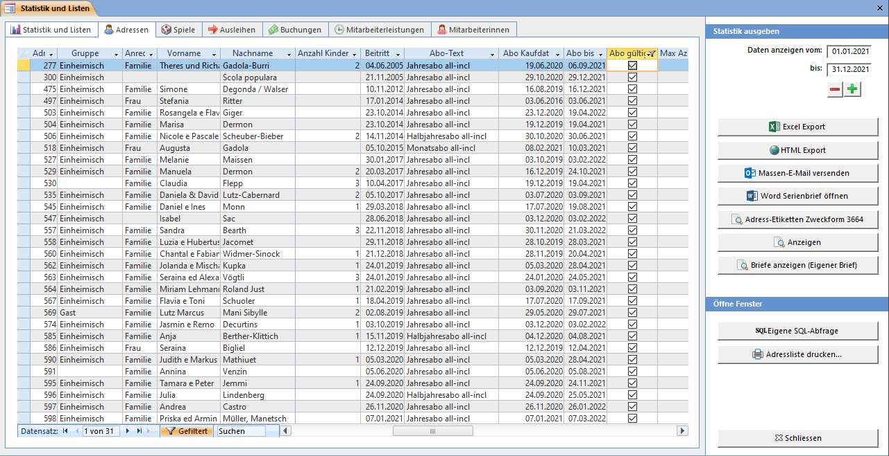

Die Liste zeigt alle aktiven Adressen. Gelöschte Adressen werden nicht angezeigt.

!!!! In allen Listen können Sie die Datensätze sortieren und filtern und in die Zwischenablage kopieren. Um den Listeninhalt zu kopieren, markieren Sie alle Datensätze indem Sie auf die linke Ecke oben in der Liste klicken. Danach drücken Sie <kbd>Ctrl</kbd>+<kbd>c</kbd> um die Daten in die Zwischenablage zu kopieren und danach in ein anderes Programm wie z.B. Word oder Excel um und von dort her formatiert auszudrucken, als Serienbrief-Datenquelle oder sonst wie zu nutzen.

### Datentabelle speichern

Die im Tabellenblatt angezeigten Daten können mit den Knöpfen Excel-Export oder HTML-Export als entsprechende Datei gespeichert werden. Sortierung und Filter des Datenblattes wird dabei beachtet. Auch können die Datensätze markiert und via Zwischenablage in ein anderes Programm eingefügt werden.

### E-Mail Massenversand

Wenn Sie auf Massen-E-Mail versenden klicken, werden Sie aufgefordert die Paketgrösse der E-Mailadressen anzugeben. Die meisten E-Mailanbieter akzeptieren nur eine bestimmte Anzahl E-Mail-Adressen in einem E-Mail (zum Schutz vor Spamversand). Geben Sie deshalb eine Zahl kleiner als 100 ein. Es werden alle E-Mailadressen der Adressliste in Blöcke an X E-Mailadressen aufgelistet. Erstellen Sie für jeden Block eine einzelne E-Mail. Die E-Mailadressen sollten Sie in das BCC-Feld (Blindkopie) kopieren.

Ist im Adress-Datenblatt im Statistik-Fenster ein Filter gesetzt, so wird dieser hier berücksichtigt. So können z.B. einfach alle Adressen ausgewählt werden, welche aktuell ein gültiges Abonnement haben.

### Personalisierte E-Mails verschicken

Anstelle der BCC-Variante kann je Kunde ein Mail erstellt werden. Es wird dabei der in den Briefeinstellungen bei "Eigener Brief" definierte Text genommen und eingesetzte Platzhalter werden dabei mit den kundenspezifischen Werten ersetzt. 
Der Knopf Sende E-Mail 1 - 21 von Total xx (Eigener Brief) erstellt je Kunde via dem in den LUPO-Einstellungen konfigurierten Mailprogramm ein E-Mail. Wenn mit Thunderbird gearbeitet wird, so muss für jedes E-Mail noch der Senden-Knopf geklickt werden. Bei Outlook und SMTP kann das Mail direkt versendet werden.

Unabhängig von der zuvor gewählten E-Mail-Blockgrösse können hier E-Mails in 20er Blöcken generiert werden. Nachdem die Mails 1 - 20 verschickt wurden ist im Dropdown 21-40 auszuwählen usw.

### Serienbrief in Word

Bei der Installation des LUPO wird die Serienbrief-Vorlage **C:\\Lupo_Daten\\Serienbrief.dotx** kopiert. Der Knopf Word Serienbrief öffnen exportiert alle angezeigten Adressen (gesetzte Filter werden beachtet) in die Datei **C:\Lupo_Daten\Serienbrief_Datenquelle.docx** und öffnet ein neues Dokument basierend auf der Vorlage in Microsoft Word (sofern installiert).

Bevor der Serienbrief angezeigt wird muss folgende Frage mit Ja bestätigt werden:

### Adressetiketten
Mit Adress-Etiketten Zweckform 3664 werden alle angezeigten Adressen (definierter Filter wird beachtet!) in Seitenansicht zum Drucken auf Etiketten angezeigt.

### Adressliste drucken

Das **Adressen drucken** Fenster kann mit Adressliste drucken geöffnet werden:

Bestimmen Sie durch Ankreuzen der entsprechenden Optionen, welche Adressen angezeigt werden sollen. Gewisse Optionen können miteinander kombiniert werden.
