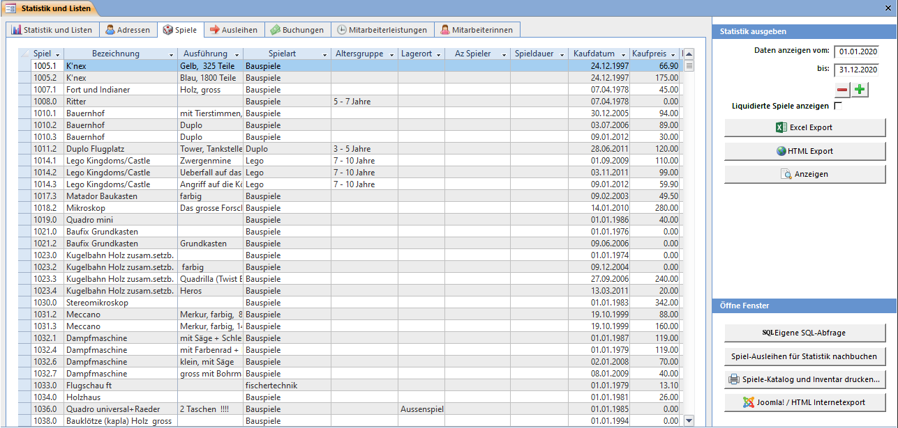
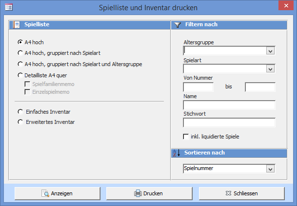
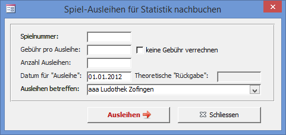

Zeigt alle Spielkinder an. Jedes Spielkind enthält auch die Daten seiner Spielfamilie.

### Spielekatalog und Inventar drucken

Spielekatalog und Inventar drucken öffnet folgendes Fenster. Diese kann auch direkt aus dem Spiele-Fenster geöffnet werden.

#### A4 hoch

Die Spielliste wird im A4 Hochformat angezeigt. Wenn Sie eine gruppierte Spielliste wählen, werden alle Spiele mit derselben Eigenschaft zusammengefasst.

#### Detailliste A4 quer

Die Spielliste wird mit allen Spielinformationen im A4 Querformat angezeigt. Das Spielgruppenmemo und das Einzelspielmemo können optional angezeigt werden.

#### Einfaches Inventar

Zeigt zwei Listen an: Eine mit allen ausgeliehenen Spielen und eine mit allen Spielen, welche sich aktuell in der Ludothek befinden.

#### Erweitertes Inventar

Diese Liste kann verwendet werden um Spiele auszumustern. Zu jedem Spiel werden die Anzahl Ausleihen pro Jahr angezeigt. Nie ausgeliehene Spiele werden fett dargestellt, liquidierte durchgestrichen.

#### Spielfilter und Sortierung

Um nicht alle Spiele anzuzeigen können Filter gesetzt werden. Bei den Feldern Altersgruppe und Spielart können die vorgegebenen Werte gewählt werden. Wollen sie nur bestimmte Spielnummern anzeigen, geben Sie einen Nummernbereich ein. Wollen Sie die Spiele nach Namen filtern, so geben sie den vollen oder den Anfang des Spiel-Namens ein. Es werden dann alle Spiele, welche wie der eingetragene Name beginnen angezeigt.

!!!! Wenn Sie eine anders sortierte oder gefilterte Spielliste wollen, so können Sie diese selbst erstellen. Öffnen Sie dazu das Datenblatt Spiele im Statistikfenster um dann die Liste entsprechend zu filtern. Kopieren Sie die Spieldaten aus dem Datenblatt in die Zwischenablage und fügen diese in Word, Excel oder sonst wo wieder ein um die Daten anschliessend zu formatieren oder weiterzuverarbeiten.

### Spielausleihen für Statistik nachbuchen

Hier können Ausleihen, welche vor der LUPO-Zeit getätigt wurden nachgebucht werden, so dass die Anzahl Ausleihen und Gebühreneinnahmen eines Spieles stimmen. Tragen Sie die Spielnummer ein, mit <kbd>Tab</kbd> zum Feld Anzahl Ausleihen springen, dann mit <kbd>Enter</kbd> Ausleihen.

