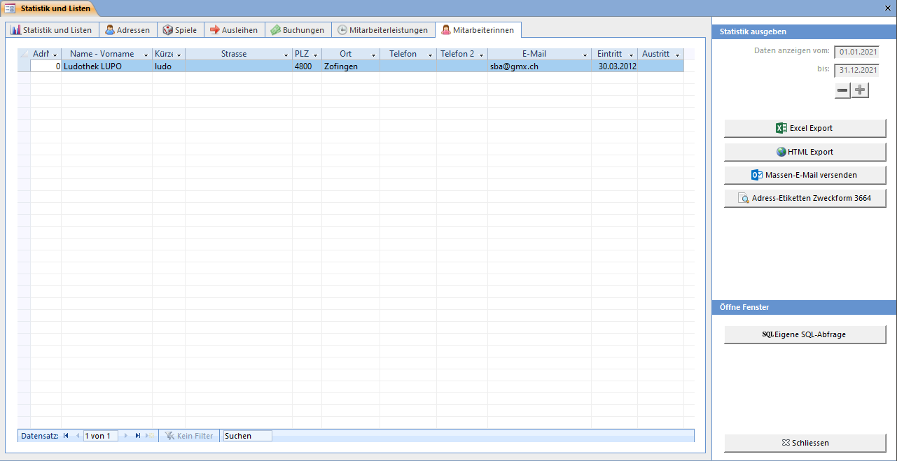

Liste aller aktiven Mitarbeiterinnen. Das Eintrittsdatum wurde beim Anhaken der Mitarbeiterin-Checkbox bestimmt.

Der Button Massen-E-Mail versenden öffnet ein Fenster, in welchem alle E-Mailadressen der Mitarbeiterinnen aufgelistet werden.

Mit Adress-Etiketten Zweckform 3664 werden alle angezeigten Adressen (ihr Filter wird beachtet!) in Seitenansicht zum Drucken auf Etiketten angezeigt.
