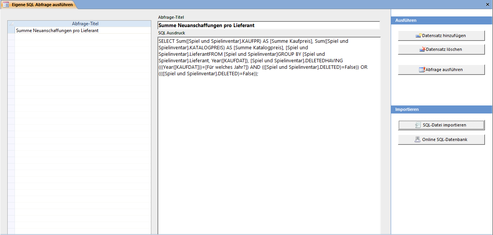

Es besteht die Möglichkeit, eigene SQL-Abfragen zu Erstellen und Speichern. Damit können Daten selektiert, verändert, eingefügt oder gelöscht werden. Dies erfordert allerdings einige Datenbank-Programmierkenntnisse und im Rahmen dieses Handbuches wird nicht weiter darauf eingegangen.

Mit der Funktion SQL-Datei importieren können vordefinierte Abfragen die Sie z.B. wegen einer Supportanfrage oder mit einen Download von unserer Website erhalten haben eingelesen werden. Eine solche Datei muss auf der ersten Zeile den Abfrage-Titel und im Rest das SQL-Statement enthalten und im ANSI Dateiformat gespeichert sein.

