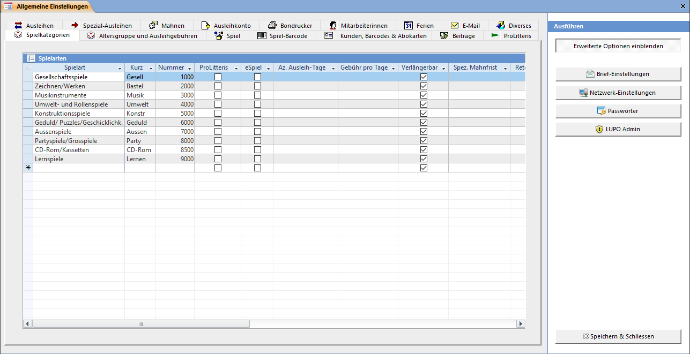

Die Allgemeinen Einstellungen erreichen Sie mit **Übersicht → Einstellungen → [Programmeinstellungen](/einstellungen/allgemeine-einstellungen)**

! Alle folgenden Bildschirmfotos sind mit gedrücktem Knopf Erweiterte Optionen einblenden erstellt worden. Damit werden auch Einstellungsmöglichkeiten angezeigt, welche meistens nicht verändert werden müssen, da der Standardwert für fast alle Ludotheken zutrifft.

Die hier eingetragenen Spielarten können den Spielen beim **Spiele erfassen** zugeordnet werden. Jeder Spielart kann ein Kürzel mit max. 10 Zeichen zugeordnet werden. Das Kürzel u. a. wird im **Spiele suchen** Fenster angezeigt.

Mit dem Nummernfeld kann der Bereich für die automatisch vorgeschlagene Spielnummer beim Erfassen eines neuen Spiels eingestellt werden. Tragen Sie 0 (Null) in jede Zeile ein, wenn Sie die Spielnummern - unabhängig der Spielart - fortlaufend vergeben wollen.

Die in den Feldern **ProLitteris, eSpiel, Anzahl Ausleihtage und Verlängerbar** gesetzte Werte werden beim Erfassen eines neuen Spiels zum Spiel **kopiert**. Eine Änderung dieser Daten in den Einstellungen hat keinen Einfluss auf bereits erfasste Spiele.

Wird bei **Gebühr pro Tage** eine Zahl eingetragen, so werden die Ausleihgebühren bei Spielen dieser Kategorie erst beim Zurückbringen verrechnet, und zwar einmal pro angebrochener Einheit.

Bei Spielen einer Kategorie mit einem Wert im Feld **Spezielle Mahnfrist** wird nicht die in den Mahneinstellungen definierte Anzahl Tage bis zur ersten Mahnung genommen, sondern der hier hinterlegte Wert.

Ist der **Retour-Bon** aktiviert, so wird beim retournieren eines Spiels dieser Spielkategorie ein Bon mit Informationen zur Spielkontrolle gedruckt.

!! Wenn Sie eine neue Spielart erfassen wollen, welche zwischen zwei bestehenden liegt (z.B. 4500) dann müssen Sie diese in ein neues, leeres Feld unten in der Liste erfassen. Fügen Sie die neue Gruppe **nicht** in der Mitte der Liste ein, indem Sie eine bestehende überschreiben (5000 zu 4500, 6000 zu 5000 usw.)
