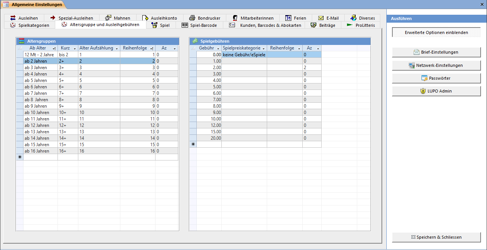

#### Altersgruppen

Die erfassten Altersgruppen können den Spielen zugeordnet werden. Das Kürzel kann max. 10 Zeichen lang sein.

#### Spielgebühren

Nur hier erfasste Gebühren können den Spielen zugeordnet werden. Der Text im Feld Spielpreiskategorie dient nur als Richtwert beim Bestimmen des Preises. Es besteht keine programmierte Verbindung zwischen Kaufpreis und Gebühr.

!!!! Der Wert in den Spalten Az gibt die Anzahl Spiele an, welche mit diesem Datensatz verknüpft sind. Es können nur Datensätze mit Anzahl=0 gelöscht werden. Sind Spiele damit verknüpft wird das Löschen verweigert.

!! Wird eine Gebühr geändert, ändert diese bei allen Spielen, welche dieser Spielgebühr zugeordnet sind.
