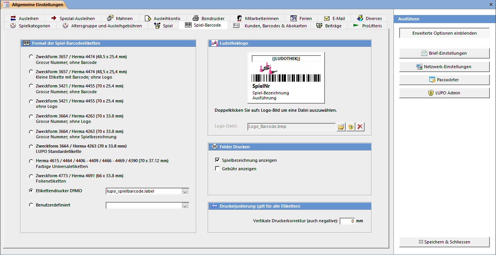

Die Etiketten zur Beschriftung der Spiele können auf A4 grosse Etikettenbogen oder einen DYMO Label-Writer gedruckt werden. Wenn Sie keinen Barcodescanner zum Einlesen der Nummer verwenden, können auch **Etiketten ohne Strichcode** gedruckt werden.

#### Format der Spiel-Barcodeetiketten

Wählen Sie eine Etikettengrösse. Je nach Format werden neben der Nummer auch noch der Barcode, die Gebühr und die Spielbezeichnung angezeigt.

#### Druckerjustierung

Damit der Ausdruck auf das Raster der Etiketten passt, ist es manchmal notwendig das Druckbild vertikal zu verschieben. Tragen Sie eine positive Zahl ein, wenn der Aufdruck im Etikett oben abgeschnitten wird, eine negative wenn er zu tief ist. Diese Einstellung gilt für alle Spiel-Etiketten und für den Spielinhalt.

#### Ludothek-Logo

Der für die Grafik reservierte Bereich hat das Seitenverhältnis 1 : 4.4 Bei einem anderen Format wird das Bild in der Mitte zentriert. Möchten Sie das Logo links ausgerichtet angezeigt bekommen, so kann rechts von der Grafik ein weisser Rand hinzugefügt werden. Der Text, welcher oberhalb des Logos definiert werden kann, wird auf Etiketten ohne Logo ausgegeben.

#### Felder Drucken

Es kann definiert werden wie die Spielbezeichnung und ob und wie die Gebühr auf das Etikett gedruckt wird.
