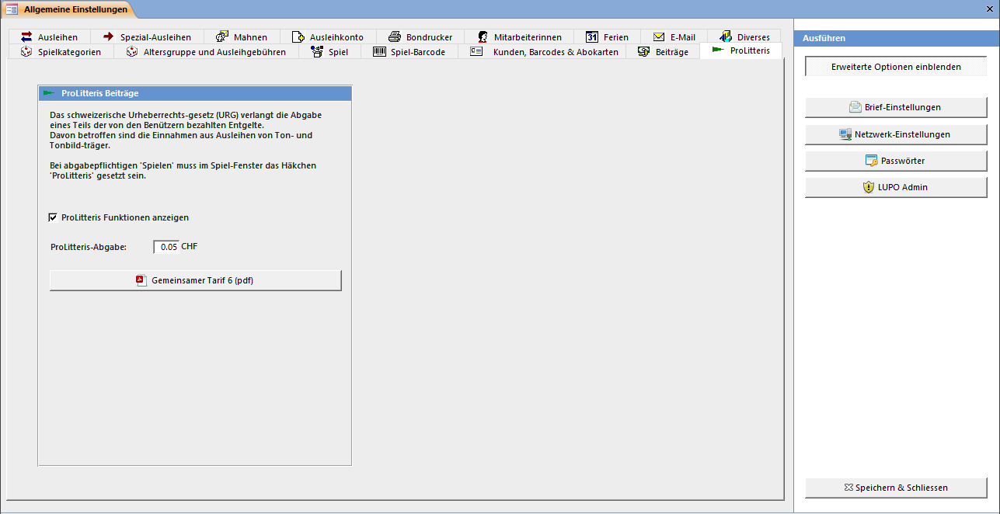

Das schweizerische Urheberrechts-gesetz (URG) verlangt die Abgabe eines Teils der von den Benützern bezahlten Entgelte. Davon betroffen sind die Einnahmen aus Ausleihen von Ton- und Tonbildträger sowie Büchern.

Falls in Ihrer Ludothek keine entsprechenden Medien ausgeliehen werden, dann deaktivieren Sie das Häkchen ProLitteris Funktionen anzeigen.

Bei abgabepflichtigen «Spielen» muss im Spiel-Fenster das Häkchen ProLitteris gesetzt sein. Das ProLitteris-Häkchen bei den Spielkategorie-Einstellungen dient nur als Vorgabe beim Erfassen eines neuen Spieles.

Mit ProLitteris Gebühren berechnen werden neu gesetzte oder entfernte Häkchen bei den Spielen berücksichtigt und die bereits berechnete Abgabe pro Ausleihe aktualisiert. Diese Aktion kann auch direkt vor dem Ausdrucken der Abrechnung im Statistik-Fenster vorgenommen werden.

Weitere Informationen zu ProLitteris können im verlinkten pdf-Dokument nachgelesen werden.
