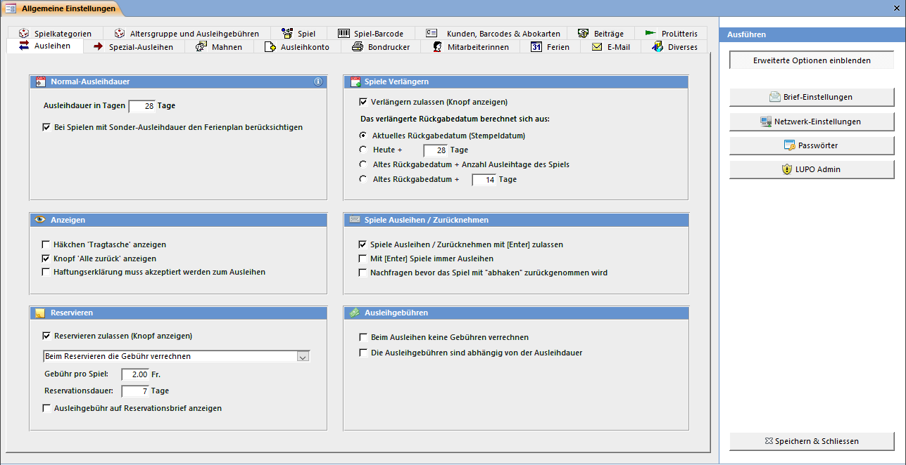
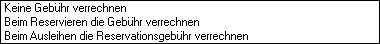
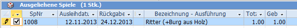
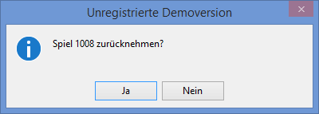

Bei den Ausleih-Einstellungen kann das Aussehen und Verhalten von Funktionen im Spiele ausleihen und zurücknehmen Fensters definiert werden.

#### Normal-Ausleihdauer

Beim Öffnen des Spiele ausleihen und zurücknehmen Fenster berechnet sich das automatisch vorgeschlagene Stempeldatum aus [heute] + [Anzahl Tage]. Wird das Datum verändert (z.B. wenn Ferien sind), werden alle Spiele, deren Ausleihdauer der Normal-Ausleihdauer entsprechen, auf das angepasste Datum ausgeliehen. Bei Spielen mit einer Ausleihdauer von z.B. nur 7 Tagen (anstatt normal 28 Tage) wird das Rückgabedatum stur aus heute + 7 Tage berechnet.

#### Anzeigen

Falls Ihre Ludothek eine Stofftasche zum Transport der Spiele dem Kunden mitgibt und Sie im LUPO die Kontrolle darüber haben wollen, kann bei jedem Kunden ein Häkchen dafür gesetzt werden. Das Häkchen dazu sollte ausgeblendet werden, wenn Sie keine Tragtaschen ausleihen.

Auch der Knopf Alle Zurück (zum Zurücknehmen aller ausgeliehenen Spiele des aktuellen Kunden mit einem Knopfdruck) kann versteckt werden.

Ist das Häkchen Haftungserklärung muss akzeptiert werden aktiviert können Spiele nur ausgeliehen werden, wenn beim Kunden das Häkchen gesetzt ist.

#### Reservieren

Falls Reservationen möglich sind muss das Kontrollkästchen Reservieren zulassen aktiviert sein.

Möglichkeiten zur Verrechnung der Gebühr:

Die Reservation dauert vom Berechnen der Reservation (das Spiel ist eingetroffen) + [Anzahl Tage], bis das Spiel wieder frei zur Ausleihung zur Verfügung steht.

#### Spiele Verlängern

Beim Spiele Verlängern können Sie zwischen drei Rechnungsarten für das verlängerte Rückgabedatum auswählen. Das neue Datum kann sich aus dem alten Rückgabedatum + Anzahl Ausleihtage (unterstes Optionsfeld aktiv) berechnen, aus heute + X Tage oder es wir das aktuelle Stempeldatum verwendet.

#### Spiele ausleihen / Zurücknehmen

Um Spiele im Spiele Ausleihen und Zurücknehmen Fenster auszuleihen oder zurückzunehmen können Sie die Nummer ins Spielfeld schreiben und <kbd>Enter</kbd> drücken. Je nachdem wird das Spiel zurückgenommen oder ausgeliehen. Dies gilt auch für das Einlesen von Nummern mit dem Barcodeleser.

Wenn Sie nun wollen, dass Spiele nur durch drücken des Ausleihen Knopfes ausgeliehen werden können, müssen Sie das Kontrollkästchen Ausleihen / Zurücknehmen mit <kbd>Enter</kbd> zulassen desaktivieren.

Ist das Kontrollkästchen Mit Enter Spiele immer ausleihen aktiviert wird bei <kbd>Enter</kbd> immer versucht das Spiel auszuleihen.

Wenn Sie mit dem Barcodeleser arbeiten und die <kbd>Enter</kbd>-Taste desaktiviert ist, muss nach dem scannen der Nummer noch der entsprechende Barcode-Befehl (Ausleihen oder Rücknahme) eingelesen werden bzw. Ausleihen oder Rücknahme geklickt werden.

!
**Einstellung**  
Falls Sie mit zwei Computern arbeiten (Netzwerkversion) und in den Netzwerkeinstellungen definiert ist, dass sich die beiden PC's als Ausgabe- und Rücknahmestation unterscheiden, gilt die <kbd>Enter</kbd>-Taste so wie in den Netzwerkeinstellungen eingestellt.

Nachfragen bevor ein Spiel mit abhaken zurückgenommen wird betrifft das Häkchen vorne in der Liste der ausgeliehenen Spiele:

Ist diese Option aktiviert, so wird beim ‚abhaken' im Ausleihfenster folgende Frage gestellt:

#### Ausleihgebühren

Werden generell keine Ausleihgebühren verrechnet kann das entsprechende Häkchen gesetzt werden. Um nur gewissen Kundengruppen oder Abonnementen eine kostenlose Ausleihe zu ermöglichen kann dies mit Spezial-Ausleihen erreicht werden.

Ist dieses Kontrollkästchen Die Ausleihgebühren sind abhängig von der Ausleihdauer angewählt, so muss der Kunde für jeden Ausleihtag die Spielgebühr bezahlen. Am Tag an welchem Sie das Spiel ausliehen wird keine Ausleihgebühr verrechnet. Die Gebühr wird erst beim zurückbringen des Spiels nach der Anzahl der ausgeliehenen Tage berechnet und belastet.

Unabhängig von dieser Einstellung funktioniert der Mahnverlauf. Überschreitet das ausgeliehene Spiel das Rückgabedatum, so wird normal eine Mahnung erstellt und die Mahngebühren dem Kunden verrechnet.
