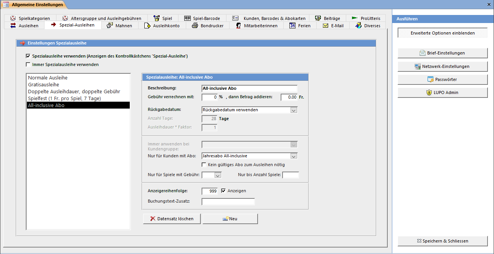

Mit Hilfe der Spezial-Ausleihe Funktion lässt sich die Spielgebühr und das Rückgabedatum einer Ausleihe verändern. Die hier definierten Spezialausleihen lassen sich im Spiele ausleihen und zurücknehmen Fenster auswählen, wenn vor dem Ausleihen das Häkchen Spezial-Ausleihe angewählt wurde.

Immer Spezialausleihe verwenden öffnet bei jeder Ausleihe das Fenster Spezial-Ausleihe.

Falls hier nur eine Spezialausleihe definiert ist, so wird beim Ausleihen mit Spezial Ausleihe das Fenster mit der Liste der Spezialausleihen nicht angezeigt sondern direkt die eine Spezialausleihe angewendet.

#### Automatische Spezial-Ausleihen

Eine Spezialausleihe kann einer Kundengruppe oder einem Abo zugeordnet werden. Soll eine Spezialausleihe für mehrere Kundengruppen/Abos verwendet werden, so muss die Spezialausleihe für jede Gruppe einzeln erfasst werden. Eine Zuordnung zu einem bestimmten Abo gilt für Kunden, welche ein gültiges haben oder wenn das Häkchen Kein gültiges Abo nötig gesetzt ist.

Es ist auch möglich eine Spezialausliehe nur für Spiele mit einer bestimmten Gebühr zu definieren. Weiter kann eine maximale Anzahl von Spielen, bei welchen die Spezialausleihe gültig ist definiert werden. Mit diesen Möglichkeiten können z.B. verschieden teure Abonnemente angeboten werden, bei welchen die ersten X Ausleihen kostenlos sind.

#### Anzeige

Die definierten Spezialausleihen werden aufsteigend nach der Anzeigereihenfolge sortiert. Falls Definitionen für automatische Spezial-Ausleihen im Ausleihfenster nicht zur Auswahl stehen sollen, dann können diese mit Anzeigen = Nein versteckt werden.

#### Buchungstext-Zusatz

Diese optionale Zeichenfolge wird dem Text 1 der Ausleihbuchung angefügt. Dies kann verwendet werden um später in der Buchhaltung Buchungen von Spezialausleihen zu erkennen.
