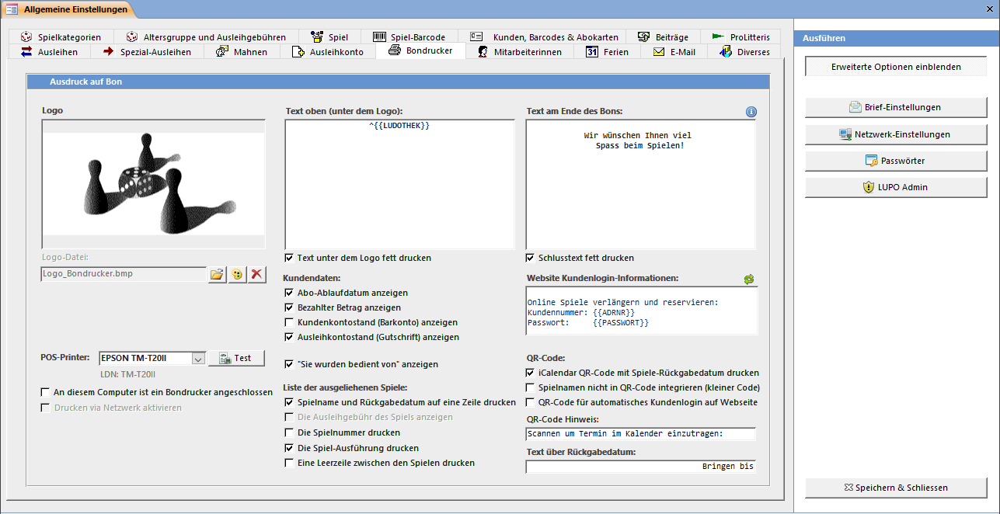

Der Bon wird mit den von Ihnen ausgewählten Informationen und eingegebenen Texte ausgedruckt. Ein Bon soll den Kunden über seine aktuell ausgeliehenen Spiele informieren und nicht als Kassenzettel gelten.

#### POS-Printer

Wählen Sie hier das von Ihnen verwendete Modell aus.

#### Netzwerkeinstellungen

Falls Sie mit zwei PC's im Netzwerk arbeiten und vom PC ohne Bondrucker auf den anderen gedruckt werden soll, dann muss das Häkchen Drucken im Netzwerk aktivieren gesetzt werden. Die Einstellung An diesem Computer ist ein Bondrucker angeschlossen muss auf jedem PC im Netzwerk entsprechend gesetzt werden.

#### Setup POS-Version

Das Häkchen EPSON SetupPOS Version 2.7 oder höher (CCO) muss mit der installierten Version korrespondieren. Für Bixolon / Metapace Bondrucker ist diese Einstellung bedeutungslos.

Um den Bondrucker und die SetupPOS-Software zu installieren lesen Sie bitte die separate Anleitung.

#### Logo auf dem Bon

Das Logo ist in der monochromen (schwarz/weiss) Bitmap-Datei Logo_Bondrucker.bmp gespeichert und wird immer auf die volle Breite des Bons ausgedruckt. Soll das Logo verkleinert ausgedruckt werden, so wird dies durch Hinzufügen eines weissen Randes auf der linken und rechten Seite der Grafik erreicht.

#### Text oben (Unter dem Logo)

Der Text wird zentriert unter dem Logo ausgedruckt. Wenn eine Zeile Text mit grosser Schrift gedruckt werden soll dann kann als erstes Zeichen ein ^ geschrieben werden.

#### Text am Ende des Bons

Dieser Text wird am Ende des Bons gedruckt. Falls Sie ein zweifarbiges (schwarz/rot) Druckerband verwenden (nur Nadeldrucker) kann der Text in der zweiten Farbe gedruckt werden. Bei einem Thermodrucker kann der Text optional fett ausgegeben werden.

!!!! Die Texte werden zentriert ausgegeben. Möchten Sie den Text links oder rechts ausgerichtet haben, so kann dies durch auffüllen mit Leerzeichen erreicht werden.

#### Abo Ablauf-Datum anzeigen

Das Datum, an welchem der Kunde sein Abo erneuern muss, wird ausgedruckt.

#### Bezahlten Betrag anzeigen

Wenn der Kunde bezahlt, wird auf dem anschliessend ausgedruckten Bon der bezahlte Betrag ausgewiesen.

#### Kundenkontostand anzeigen

Der Kundenkontostand wird ausgedruckt. Diese Information sollte nicht ausgedruckt werden, wenn bereits der bezahlte Betrag angezeigt wird.

#### Ausleihkontostand anzeigen

Falls der Kunde Geld auf seinem Ausleihkonto hat, wird der Betrag auf den Bon gedruckt.

#### Liste der ausgeliehenen Spiele anzeigen

Definieren Sie hier die Darstellung der Liste mit den ausgeliehenen Spielen.

#### QR-Code

Falls der Bon mit einem Thermodrucker (ausgenommen EPSON TM-T88III) gedruckt wird, besteht die Möglichkeit einen QR-Code zum Erstellen eines Eintrages im Kalender des Smartphones zu drucken.

**Bon mit QR-Code:**

**QR-Code Reader:**

**Kalendereintrag:**

Der QR-Code enthält das Rückgabedatum und eine Liste mit den Namen aller ausgeliehenen Spiele des Kunden. Bei verschiedenen Rückgabedaten wird pro Datum ein QR-Code gedruckt.

Der Code besteht aus einen im iCalendar-Format codierten Termin und kann mit einer QR-Reader App unter Android und iOS gelesen werden. Windows Phone 8.1 unterstützt iCalendar-Termine nicht.
