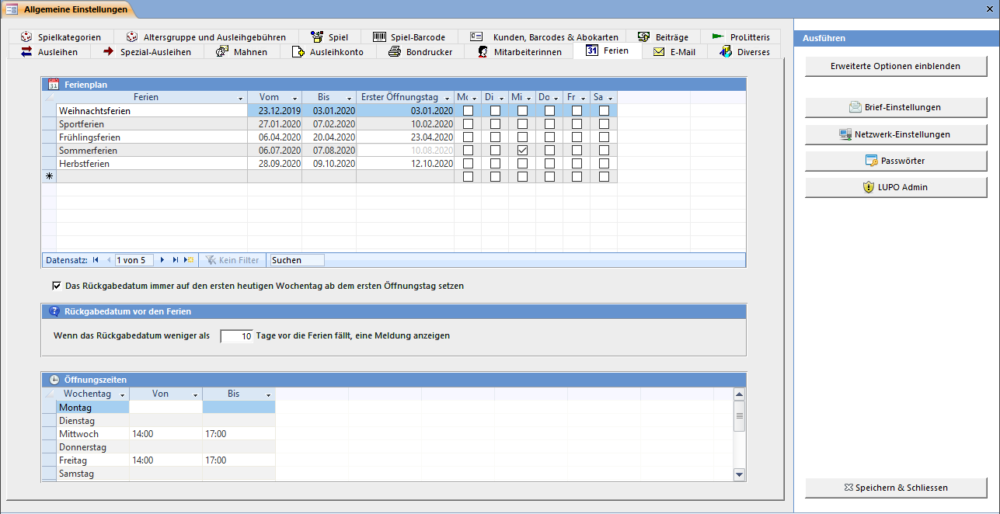

Der Ferienplan hilft Ihnen das Rückgabdatum (Stempeldatum) beim Ausleihen oder Verlängern so anzupassen, dass der Kunde das Spiel nicht dann zurückbringen muss, wenn die Ludothek geschlossen ist. Es besteht jederzeit die Möglichkeit das von der Software berechnete Rückgabedatum manuell zu verändern.

#### Ferienplan

Zum Erfassen der Schulferien oder auch einzelner regulärer Öffnungstage, an welchen die Ludo geschlossen bleibt. Falls Sie den ersten Öffnungstag nicht wissen, dann kann dasselbe Datum wie im Feld Bis eintragen werden.

Wenn in den Ferien die Ludothek lediglich reduzierte Öffnungszeiten hat kann der Tag oder die Tage, an welchen die Ludothek geöffnet hat, mit einem Häkchen in der Spalte Mo – Sa definiert werden. Ist ein Tag gewählt so wird das im Feld Erster Öffnungstag eingetragene Datum ignoriert.

Wenn das automatische berechnete Stempeldatum (**[heute] + [Anzahl Ausleihtage]**) beim Öffnen des Spiele ausleihen und zurücknehmen Fenster auf einen Ferientag fällt, erscheint folgende Meldung:

#### Heutiger Wochentag

Mit der Option Das Rückgabedatum immer auf den ersten heutigen Wochentag ab dem ersten Öffnungstag setzen wird das automatisch berechnete Rückgabedatum stets auf denselben Wochentag wie der heute aktuelle Tag gesetzt. Will heissen: Wenn heute Donnerstag Ausleihe ist, dann wird das Rückgabedatum auf den ersten Donnerstag nach den Ferien gesetzt, auch wenn der erste Öffnungstag an einem Dienstag ist.

#### Rückgabedatum vor den Ferien

Spiele bis [Anzahl Tage] vor Ferienbeginn müssen noch zurückgebracht werden. Fällt das Rückgabedatum weniger als die eingestellten [Anzahl Tage] vor die Ferien meldet das Programm, die Kunden auf allfällige Verlängerungen aufmerksam zu machen. Tragen Sie 0 (Null) ein um diese Meldung zu deaktivieren.
