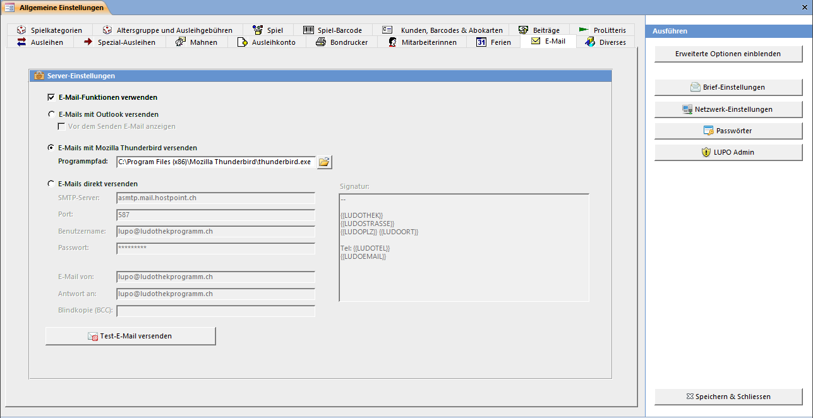

Mit LUPO können Mahnungen für verspätete Spiele und die Information, dass ein reserviertes Spiel abholbereit ist, per E-Mail versendet werden.

#### E-Mails mit Outlook versenden

Dazu muss Microsoft Outlook installiert und ein E-Mail-Konto eingerichtet sein. Falls Sie die E-Mails vor dem Versand anschauen möchten, dann kann die Einstellung **vor dem Senden E-Mail anzeigen** aktiviert werden.

#### E-Mails mit Mozilla Thunderbird versenden

Um E-Mails mit Thunderbird zu versenden, muss der Pfad zur exe-Datei definiert werden. Beim Versenden wird jedes E-Mail in einem eigenen Fenster geöffnet und muss manuell durch Drücken von **Senden** abgeschickt werden.

#### E-Mails direkt versenden

E-Mails werden direkt aus LUPO an einen SMTP-Server geschickt und von diesem versendet. Sie können dies über den Server smtp.ludothekprogramm.ch tun oder einen eigenen verwenden. Dazu müssen Sie die Server-Adresse, der Port, Benutzername und Kennwort kennen.

E-Mail von ist die Absenderadresse des E-Mails, Antwort an ist optional und kann verwendet werden, wenn Antwort-E-Mails an eine andere Adresse als den Absender geschickt werden sollen.

Die Signatur wird unten an jede E-Mail angefügt (aber nicht bei Versand mit Outlook oder Thunderbird).

!! Falls der Direkt-Versand von E-Mails nicht klappt, prüfen Sie, ob Ihre Firewall oder der Virenscanner den Port blockt. Je nach System und Aufbau des Netzwerkes kann auch ihr Internet-Router eine Firewall haben und ausgehende E-Mails blockieren.

#### Test E-Mail versenden

Es wird eine Test-E-Mail mit der von Ihnen gewählten Konfiguration versendet. Konnte das E-Mail fehlerfrei von LUPO ausgeliefert werden wird hinter dem Knopf ein grünes Häkchen angezeigt:

