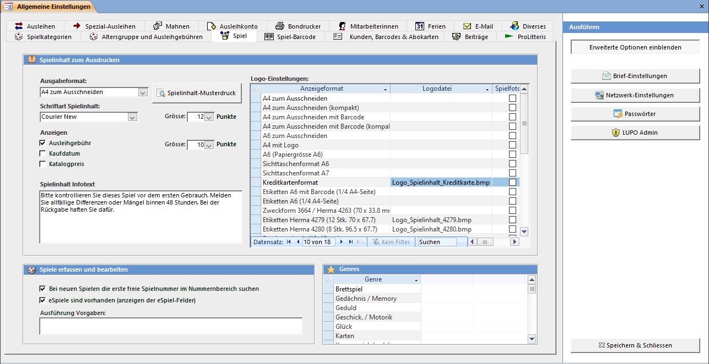
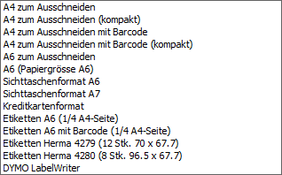

Unter Spielinhalt wird das Inventar eines Spiels verstanden (1 Spielanleitung, 3 Würfel, 21 Karten, …) Bestimmen Sie in diesem Einstellungsfenster das Erscheinungsbild des Ausdrucks.

#### Anzeigen

Setzen Sie das Häkchen für die Felder, welche auf dem Spielinhalt-Ausdruck angezeigt werden sollen. Bei den kleinen Etiketten werden diese Infos nicht angezeigt.

#### Spielinhalt Infotext

Beliebig viel Text kann für den Spielinhalt A4 zum Ausschneiden erfasst werden. Bei den Sichttaschen und dem ¼ A4-Etikett wird der Text abgeschnitten, wenn er zu lang ist. Die anderen Etiketten zeigen den Text nicht an.

#### Schriftart und Grösse

Der Textblock mit dem Spielinhalt wird in der eingetragenen Schriftart und -grösse angezeigt. Sie können auch eine eigene Schriftart eintragen. Achten Sie dabei auf die exakte Schreibweise

#### Ausgabeformat

Es stehen Ihnen drei verschiedene Ausdruckarten zur Auswahl. Der Format A4 zu Ausschneiden ist geeignet für Schachtelspiele mit beliebig viel Inhaltstext. Das Format Sichttaschenformat wird auch auf normales Papier gedruckt, kann aber ausgeschnitten und gefaltet in eine A7 / A6 Plastiktasche gesteckt werden. Dieses Format ist geeignet für Aussenspiele. Als dritte Möglichkeit kann der Spielinhalt auf ein Etikett gedruckt werden.

#### Logo-Datei

Einige Ausgabeformate haben Platz um eine Grafik anzuzeigen. Wählen Sie eine Bitmap-Grafik (.bmp)
